**Version:** 1.0   
**Status:** Active  
**Hard Deadline:** July 1, 2026 - App live in App Store & Play Store

---

## Executive Summary
This document outlines the development plan for the JSU XIX mobile application. We organize work using **Sprints** (2-week timeframe in which we focus on something specific), **Epics** (buckets of similar tasks grouped together) and **Tasks**.

### Timeline Overview

```mermaid
flowchart LR
    subgraph Foundation["🏗️ Foundation Phase"]
        S0[S0: Setup]
        S1[S1: Auth]
    end
    
    subgraph Core["⭐ Core Features Phase"]
        S2[S2: Profiles]
        S3[S3: QR Scanner]
        S4[S4: Drinks]
        S5[S5: Docs/Gallery]
    end
    
    subgraph Advanced["🚀 Advanced Phase"]
        S6[S6: Alerts/Chat]
        S7[S7: Admin/Houses]
        S8[S8: Reports]
    end
    
    subgraph Release["📱 Release Phase"]
        S9[S9: Store Prep]
        S10[S10: Rejections]
        S11[S11: Buffer]
        LIVE((🎉 LIVE))
    end
    
    S0 --> S1 --> S2 --> S3 --> S4 --> S5 --> S6 --> S7 --> S8 --> S9 --> S10 --> S11 --> LIVE
    
    style Foundation fill:#e0f2fe
    style Core fill:#dcfce7
    style Advanced fill:#fef3c7
    style Release fill:#fce7f3
    style LIVE fill:#4ade80,stroke:#16a34a,stroke-width:3px
```

**Key Milestones:**
- **Setup** - Sprint 0 (Dec 9-22)
- **Auth** - Sprint 1 (Jan 6-18)
- **Peak Productivity** - Sprints 3-5 (Feb 23 - Apr 6) at 70% capacity
- **Code Freeze** - May 18, 2026
- **App Live** - July 1, 2026

### Critical Constraint
**Year 3 seniors (Bogdi, Paul)** have thesis defense **June 29 - July 5, 2026**. All complex development must be completed by **May 18** (code freeze).

---

## 1. Team Composition & Availability

### 1.1 Team Matrix

| Role              | Name             |
| ----------------- | ---------------- |
| **Tech Lead**     | Davide Bara      |
| **Mobile Senior** | Bogdi Șchiop     |
| **Mobile Senior** | Paul Șchiop      |
| **Mobile Mid**    | Rareș Dobre      |
| **Mobile Mid**    | Alex Băncilă     |
| **UI/UX Design**  | David Posa       |
| **Junior Dev**    | Ioana Mincu      |
| **Junior Dev**    | Bogdan Ciobănașu |
| **Junior Dev**    | Raul Gliga       |

### 1.2 Team Capacity & Constraints

| Period                    | Dates           | Impact on Team                      |
| ------------------------- | --------------- | ----------------------------------- |
| End of Semester 1         | Dec 9-22, 2025  | 50% capacity - classes winding down |
| **Christmas Vacation**    | Dec 23 - Jan 5  | **15% capacity** - holidays         |
| Classes Resume            | Jan 6-18, 2026  | 35% capacity - before exams         |
| **Semester 1 Exams**      | Jan 19 - Feb 8  | **15% capacity** - exam session     |
| Vacation + Retakes        | Feb 9-22        | 50% capacity                        |
| Semester 2 Classes        | Feb 23 - Apr 12 | **70% capacity** - peak window      |
| **Easter Vacation**       | Apr 13-19       | **20% capacity** - holiday          |
| Classes Resume            | Apr 20 - May 24 | 60% capacity                        |
| **Year 3 Exams**          | May 25 - Jun 7  | Bogdi & Paul limited                |
| **Year 1-2 Exams**        | Jun 8-28        | 30% capacity                        |
| **Thesis Defense (Yr 3)** | Jun 29 - Jul 5  | **Bogdi & Paul unavailable**        |
*Might be modified depending on FutureUP, UBB Festival and IT OSUBB estimated efforts.*

### 1.3 Role Responsibilities

**Tech Lead (Davide)**
- Architecture decisions and Supabase setup
- Edge Functions development
- Code reviews and quality assurance
- Store submission process management
- Team coordination and blocker removal

**Mobile Seniors (Bogdi, Paul)**
- Complex features: QR scanner, drink tracking, realtime
- Camera integration and native modules
- Push notification setup (OneSignal)
- Performance optimization
- Knowledge transfer to mid-level and junior devs

**Mobile Mid (Rareș, Alex)**
- UI implementation from Figma designs
- Medium complexity features
- Bug fixes and maintenance
- Testing support
- Take over from seniors in June

**UI/UX Design (David)**
- Figma designs for all screens
- Component library design
- Design system documentation
- UI polish and visual QA

**Junior Devs (Raul, Bogdan, Ioana)**
- Simple UI components
- Testing and QA assistance
- Documentation
- Learning and pair programming

---

## 2. Epic Breakdown

### 2.1 Must-Have Epics (v1.0)

| Epic | Description                | Priority | Complexity | Primary Role        |
| ---- | -------------------------- | -------- | ---------- | ------------------- |
| E1   | Project Setup & Onboarding | P0       | Low        | Tech Lead           |
| E2   | Authentication System      | P0       | Medium     | Tech Lead + Seniors |
| E3   | User Profiles + QR Display | P0       | Medium     | Mid-level           |
| E4   | Schedule/Events Display    | P0       | Low        | Mid-level + Juniors |
| E5   | QR Scanner                 | P0       | High       | Seniors             |
| E6   | Drink Tracking             | P0       | High       | Seniors             |
| E7   | RO-Alert Notifications     | P0       | High       | Seniors + Tech Lead |
| E8   | Document Upload            | P0       | Medium     | Mid-level           |
| E9   | Photo Gallery              | P1       | Low        | Mid-level + Juniors |
| E10  | Leaderboard                | P1       | Low        | Juniors             |
| E11  | Meal Voting                | P1       | Medium     | Mid-level           |
| E12  | Attendance System          | P1       | Medium     | Mid-level           |
| E13  | Admin Dashboard            | P0       | High       | Tech Lead + Seniors |
| E14  | Coordinator Dashboard      | P0       | Medium     | Mid-level           |
| E15  | Reports                    | P1       | Medium     | Tech Lead           |
| E16  | House System (reveal)      | P0       | Medium     | Seniors             |
| E17  | Faculty Chat               | P2       | Medium     | Seniors             |
| E18  | House Chat                 | P2       | Medium     | Seniors             |
| E19  | Testing & QA               | P0       | Medium     | All                 |
| E20  | Store Submission           | P0       | Medium     | Tech Lead           |
→ implement search as alternative for qr codes
### 2.2 Epic Details

#### E1: Project Setup & Onboarding
**Acceptance Criteria:**
- [ ] Expo SDK 52+ project initialized with TypeScript
- [ ] Supabase project created and configured
- [ ] NativeWind (Tailwind) configured
- [ ] Expo Router navigation structure
- [ ] All team members have working dev environment
- [ ] Git workflow established (branches, PRs, reviews)
- [ ] Basic CI/CD with EAS configured

#### E2: Authentication System
**Acceptance Criteria:**
- [ ] Login screen with username/password
- [ ] Supabase Auth integration with custom email format
- [ ] Role-based routing (participant/coordinator/admin)
- [ ] Session persistence (AsyncStorage)
- [ ] Logout functionality
- [ ] Error messages in Romanian

#### E3: User Profiles + QR Display
**Acceptance Criteria:**
- [ ] Profile view with all fields (name, age, pronouns, faculty, room, score)
- [ ] QR code generation from unique ID
- [ ] QR code cached for offline access
- [ ] House displayed as "???" until reveal
- [ ] Profile photo display

#### E4: Schedule/Events Display
**Acceptance Criteria:**
- [ ] Daily schedule view with all event types
- [ ] Event details (title, time, location, type)
- [ ] Day selector/navigation
- [ ] Faculty-specific events filtered
- [ ] Pull-to-refresh

#### E5: QR Scanner
**Acceptance Criteria:**
- [ ] Camera permission handling
- [ ] QR code scanning with expo-camera
- [ ] Participant lookup from QR data
- [ ] Profile display after scan
- [ ] <1 second response time
- [ ] Low-light handling

#### E6: Drink Tracking
**Acceptance Criteria:**
- [ ] Drink count display after QR scan
- [ ] "Add drink" button with confirmation
- [ ] Age-based limits (under 18 / 18+)
- [ ] Admin-configurable limits per party
- [ ] "Too drunk" blocking feature
- [ ] "Limit reached" visual indicator
- [ ] Drink history per participant

#### E7: RO-Alert Notifications
**Acceptance Criteria:**
- [ ] OneSignal integration
- [ ] Full-screen alert modal
- [ ] Alert sound (loud, distinctive)
- [ ] Vibration pattern
- [ ] "Am înțeles" acknowledgment button
- [ ] Works when app is closed (push)
- [ ] Target by role (participants/coordinators/all)
- [ ] Alert history in database

#### E8: Document Upload
**Acceptance Criteria:**
- [ ] 5 document types uploadable
- [ ] PDF/PNG/JPG support
- [ ] Individual upload per document
- [ ] Upload progress indicator
- [ ] "Gata" submission button
- [ ] Status tracking (incomplete/complete/confirmed)
- [ ] Admin can view all documents
- [ ] Secure storage (private bucket)

#### E9: Photo Gallery
**Acceptance Criteria:**
- [ ] Grid display of images
- [ ] Image full-screen view
- [ ] Admin upload capability
- [ ] Lazy loading / virtualization
- [ ] Pull-to-refresh

#### E10: Leaderboard
**Acceptance Criteria:**
- [ ] Top 10 participants display
- [ ] Position, name, score columns
- [ ] Current user's position shown
- [ ] House rankings (admin-set)
- [ ] Real-time updates

#### E11: Meal Voting
**Acceptance Criteria:**
- [ ] Menu options display
- [ ] Vote submission
- [ ] One vote per user per meal
- [ ] Voting open/closed state
- [ ] Results visible to admin

#### E12: Attendance System
**Acceptance Criteria:**
- [ ] Coordinators can mark faculty attendance
- [ ] Meal attendance tracking
- [ ] Accommodation attendance tracking
- [ ] Bulk marking ("all present")
- [ ] Attendance history

#### E13: Admin Dashboard
**Acceptance Criteria:**
- [ ] Dashboard overview
- [ ] Event CRUD operations
- [ ] House management (create, assign, reveal)
- [ ] Party settings (drink limits)
- [ ] RO-Alert sending interface
- [ ] Gallery management
- [ ] Document status overview

#### E14: Coordinator Dashboard
**Acceptance Criteria:**
- [ ] Faculty participant list
- [ ] House participant list (after reveal)
- [ ] QR scanner access
- [ ] Attendance marking
- [ ] Drink records view
- [ ] Schedule view

#### E15: Reports
**Acceptance Criteria:**
- [ ] Drink statistics per event
- [ ] Attendance statistics
- [ ] Meal vote results
- [ ] Document submission status
- [ ] Export capability (optional)

#### E16: House System
**Acceptance Criteria:**
- [ ] Houses initially hidden ("???")
- [ ] Admin reveal trigger
- [ ] All houses revealed simultaneously
- [ ] House name visible after reveal
- [ ] Housemates list visible after reveal
- [ ] RO-Alert sent on reveal

#### E17: Faculty Chat
**Acceptance Criteria:**
- [ ] Real-time messaging (Supabase Realtime)
- [ ] Message list with sender info
- [ ] Text input and send
- [ ] Visible from project start
- [ ] Faculty members + coordinators only

#### E18: House Chat
**Acceptance Criteria:**
- [ ] Locked until house reveal
- [ ] Real-time messaging
- [ ] House members only
- [ ] Unlock triggered by reveal

---

## 3. Sprint Timeline

[Backup link](https://www.mermaidchart.com/app/projects/ddaed451-929d-4dde-b9f4-7646a5216cf1/diagrams/22d362dc-c186-482c-b898-221aa8933822/version/v0.1/edit)
[Jira](https://it-jsu.atlassian.net/jira/software/projects/JSU/boards/1/backlog)

### Sprint 0: Setup & Onboarding
**Dates:** December 9-22, 2025  
**Capacity:** 50%  
**Focus:** Foundation

| Task                                      | Role      | Story Points |
| ----------------------------------------- | --------- | ------------ |
| Create Expo project with TypeScript       | Tech Lead | 2            |
| Set up Supabase project                   | Tech Lead | 3            |
| Configure NativeWind                      | Tech Lead | 2            |
| Set up Expo Router structure              | Tech Lead | 3            |
| Create Git repo and branch strategy       | Tech Lead | 1            |
| Environment setup documentation           | Tech Lead | 2            |
| Help all team members set up environments | All       | 5            |
| Begin Figma design system                 | UI/UX     | 5            |
| React Native / Expo self-study            | All       | 3            |
| Supabase training self-study              | All       | 3            |

**Sprint Goal:** All developers can run the app locally and understand the tech stack.

---

### Holiday Break
**Dates:** December 23 - January 5, 2026  
**Capacity:** 15%  
**Focus:** Light async work only

- Optional: team members explore tutorials (React Native, Supabase, Cursor) & UI/UX continues Figma designs
- No meetings or deadlines

---

### Sprint 1: Authentication
**Dates:** January 6-18, 2026  
**Capacity:** 35%  
**Focus:** Core auth flow

| Task | Role | Story Points |
|------|------|--------------|
| Database schema migration (profiles, faculties, houses) | Tech Lead | 5 |
| Supabase Auth configuration | Tech Lead | 3 |
| Login screen UI | UI/UX + Mid | 3 |
| Auth hook implementation | Seniors | 5 |
| Role-based routing | Seniors | 3 |
| Session persistence | Seniors | 2 |
| Error handling (Romanian messages) | Mid | 2 |
| Basic navigation structure | Mid | 3 |

**Sprint Goal:** Users can log in and are routed to role-specific dashboards.

---

### Exam Period
**Dates:** January 19 - February 8, 2026  
**Capacity:** 15%  
**Focus:** Light async work

- Finalize Figma designs for core screens
- Database schema review and refinement
- Documentation updates
- No sprint ceremonies

---

### Sprint 2: Profiles & Schedule
**Dates:** February 9-22, 2026  
**Capacity:** 50%  
**Focus:** Participant core features

| Task | Role | Story Points |
|------|------|--------------|
| Profile screen UI | UI/UX + Mid | 5 |
| Profile data fetching | Mid | 3 |
| QR code generation component | Seniors | 3 |
| QR code offline caching | Seniors | 2 |
| Schedule screen UI | UI/UX + Mid | 5 |
| Events data fetching and display | Mid | 3 |
| Day selector component | Juniors | 2 |
| Event card component | Juniors | 2 |
| Events database table + RLS | Tech Lead | 3 |

**Sprint Goal:** Participants can view their profile with QR code and see the daily schedule.

---

### Sprint 3: QR Scanner
**Dates:** February 23 - March 9, 2026  
**Capacity:** 70% ⭐ Peak  
**Focus:** QR system foundation

| Task | Role | Story Points |
|------|------|--------------|
| Camera permission handling | Seniors | 2 |
| QR scanner component with expo-camera | Seniors | 5 |
| Participant lookup from QR data | Seniors | 3 |
| Scanned participant profile display | Seniors + Mid | 3 |
| Scanner UI (frame overlay, feedback) | UI/UX + Mid | 3 |
| Performance optimization (<1s) | Seniors | 3 |
| Low-light testing and handling | Seniors | 2 |
| Edge cases (invalid QR, not found) | Mid | 2 |

**Sprint Goal:** Coordinators/admins can scan participant QR codes and see their profile.

---

### Sprint 4: Drink Tracking
**Dates:** March 10-23, 2026  
**Capacity:** 70% ⭐ Peak  
**Focus:** Complete drink system

| Task | Role | Story Points |
|------|------|--------------|
| Drink records database table | Tech Lead | 2 |
| Party settings table (limits) | Tech Lead | 2 |
| Drink tracking hooks | Seniors | 5 |
| Drink tracker UI component | Seniors + UI/UX | 5 |
| Add drink flow with confirmation | Seniors | 3 |
| Age-based limit logic | Seniors | 3 |
| "Too drunk" blocking feature | Seniors | 3 |
| Limit reached visual state | UI/UX + Mid | 2 |
| Party settings admin UI | Mid | 3 |

**Sprint Goal:** Full drink tracking system operational with age-based limits.

---

### Sprint 5: Documents & Gallery + Chat UI
**Dates:** March 24 - April 6, 2026  
**Capacity:** 70% ⭐ Peak  
**Focus:** Content management + chat foundation

| Task | Role | Story Points |
|------|------|--------------|
| Documents storage bucket setup | Tech Lead | 2 |
| Document upload hook | Mid | 5 |
| Document picker integration | Mid | 3 |
| Document status UI | UI/UX + Mid | 3 |
| "Gata" submission flow | Mid | 2 |
| Gallery storage bucket | Tech Lead | 1 |
| Gallery grid component | Juniors | 3 |
| Gallery image viewer | Juniors | 2 |
| Admin gallery upload | Mid | 3 |
| **Chat UI components** (bubbles, input, list) | UI/UX + Mid | 5 |
| Chat messages table + RLS | Tech Lead | 3 |

**Sprint Goal:** Document upload working, gallery viewable, chat UI components ready.

---

### Sprint 6: RO-Alert + Faculty Chat
**Dates:** April 7-20, 2026  
**Capacity:** 40% (Easter Apr 13-19)  
**Focus:** Realtime features

| Task | Role | Story Points |
|------|------|--------------|
| OneSignal account and project setup | Tech Lead | 2 |
| Push notification configuration (iOS/Android) | Seniors | 5 |
| RO-Alert Edge Function | Tech Lead | 5 |
| RO-Alert modal component | Seniors + UI/UX | 5 |
| Alert sound and vibration | Seniors | 3 |
| Alert acknowledgment flow | Seniors | 2 |
| **Faculty chat hook** (Supabase Realtime) | Seniors | 5 |
| **Faculty chat screen** | Mid | 3 |
| RO-Alert admin sending UI | Mid | 3 |

**Sprint Goal:** RO-Alert system fully functional, Faculty Chat working with realtime.

---

### Sprint 7: Admin + Houses + House Chat
**Dates:** April 21 - May 4, 2026  
**Capacity:** 60%  
**Focus:** Admin features + house system

| Task | Role | Story Points |
|------|------|--------------|
| Admin dashboard layout | UI/UX + Mid | 5 |
| Event CRUD operations | Tech Lead + Mid | 5 |
| House management UI | Mid | 3 |
| House reveal Edge Function | Tech Lead | 3 |
| House reveal trigger (admin) | Mid | 2 |
| **House chat hook** | Seniors | 3 |
| **House chat screen** (locked state) | Mid | 3 |
| **House chat unlock on reveal** | Seniors | 2 |
| Meal menu setup | Mid | 3 |
| Meal voting component | Juniors | 3 |

**Sprint Goal:** Admin can manage events/houses, house reveal works, house chat activates.

---

### Sprint 8: Reports, Leaderboard, Attendance, Coordinator
**Dates:** May 5-18, 2026  
**Capacity:** 60%  
**Focus:** Final features + knowledge transfer  
**⚠️ Last sprint with Year 3 seniors**

| Task | Role | Story Points |
|------|------|--------------|
| Coordinator dashboard layout | UI/UX + Mid | 3 |
| Faculty/house participant lists | Mid | 3 |
| Attendance marking UI | Mid | 3 |
| Attendance database + hooks | Tech Lead | 3 |
| Leaderboard component | Juniors | 3 |
| Leaderboard data hook | Mid | 2 |
| House rankings display | Juniors | 2 |
| Drink reports view | Tech Lead | 3 |
| Attendance reports view | Tech Lead | 3 |
| Document status report | Tech Lead | 2 |
| **Knowledge transfer sessions** | Seniors → Mid | 5 |
| Code documentation | Seniors | 3 |

**Sprint Goal:** All features complete. Seniors transfer knowledge to mid-level devs.

---

### Sprint 9: Code Freeze & Store Prep
**Dates:** May 19 - June 1, 2026  
**Capacity:** 40% (Year 3 exams start May 25)  
**Focus:** Freeze and submit

| Task | Role | Story Points |
|------|------|--------------|
| Feature freeze (May 18 EOD) | All | - |
| End-to-end testing | All | 8 |
| Bug fixes (critical only) | Mid + Tech Lead | 5 |
| App icons and splash screen | UI/UX | 2 |
| Store screenshots (all screens) | UI/UX | 3 |
| Store descriptions (Romanian) | Tech Lead | 2 |
| Privacy policy page | Tech Lead | 1 |
| iOS provisioning and certificates | Tech Lead | 3 |
| Android signing key | Tech Lead | 2 |
| First App Store submission | Tech Lead | 3 |
| First Play Store submission | Tech Lead | 2 |

**Sprint Goal:** App submitted to both stores by May 28.

---

### Sprint 10: Rejection Handling
**Dates:** June 2-15, 2026  
**Capacity:** 30% (Year 1-2 exams)  
**Focus:** Fix and resubmit

| Task | Role | Story Points |
|------|------|--------------|
| Monitor store review status | Tech Lead | - |
| Address App Store rejections | Tech Lead + Mid | Variable |
| Address Play Store rejections | Tech Lead + Mid | Variable |
| Bug fixes from testing | Mid | Variable |
| UI polish items | UI/UX | 3 |
| Resubmissions as needed | Tech Lead | - |

**Sprint Goal:** App approved in at least one store.

---

### Sprint 11: Final Buffer
**Dates:** June 16-29, 2026  
**Capacity:** 25% (Thesis defense period)  
**Focus:** Final fixes and launch prep

| Task | Role | Story Points |
|------|------|--------------|
| Final rejection handling | Tech Lead | Variable |
| Critical bug fixes only | Tech Lead + Mid | Variable |
| Account generation script | Tech Lead | 3 |
| Seed faculties and houses data | Tech Lead | 2 |
| Coordinator training documentation | Tech Lead | 3 |
| Admin training session | Tech Lead | 2 |
| Final smoke testing | Mid + Juniors | 3 |

**Sprint Goal:** App live in stores, ready for coordinators/admins on July 1.

---

---

## 4. Risks

| Risk                                          | Probability | Impact | Mitigation                                                             |
| --------------------------------------------- | ----------- | ------ | ---------------------------------------------------------------------- |
| **Year 3 seniors unavailable in June**        | Certain     | High   | Front-load all complex work to May 18; knowledge transfer in Sprint 8  |
| **App Store rejection**                       | High        | High   | Submit early (May 25), budget 4+ weeks for review cycles               |
| **Exam period reduces capacity**              | Certain     | Medium | Adjust sprint scope during Jan/Jun; no critical deadlines during exams |
| **Easter vacation delays**                    | Certain     | Low    | Sprint 6 has reduced scope; prioritize must-haves                      |
| **OneSignal/iOS critical alerts setup fails** | Medium      | High   | Start early in Sprint 6; have fallback to regular push                 |
| **Team member drops out**                     | Medium      | Medium | Cross-train team; document everything; use agentic coding              |
| **Supabase Realtime issues**                  | Low         | High   | Test early; have polling fallback                                      |
| **Scope creep**                               | Medium      | Medium | Strict prioritization; alignment on must-haves                         |

---

## 5. Knowledge Transfer Plan

### 5.1 From Seniors to Mid-Level (Sprint 8)

| Topic                         | Seniors | Receivers       | Format              |
| ----------------------------- | ------- | --------------- | ------------------- |
| QR Scanner internals          | Bogdi   | Rareș           | Pair session + docs |
| Drink tracking logic          | Paul    | Alex            | Code walkthrough    |
| Supabase Realtime patterns    | Bogdi   | Rareș, Alex     | Workshop            |
| Push notification debugging   | Paul    | Tech Lead       | Documentation       |
| React Native performance tips | Both    | All mid/juniors | Team session        |

### 5.2 Documentation Requirements

Before Sprint 9, seniors must document:
- [ ] QR scanner troubleshooting guide
- [ ] Drink tracking edge cases and logic
- [ ] Chat system architecture
- [ ] Common React Native issues and fixes
- [ ] OneSignal configuration guide

---

## 6. June Backup Plan

**Who handles what when seniors are unavailable (June 2 onwards):**

| Area                     | Owner                     |
| ------------------------ | ------------------------- |
| Store submission issues  | Davide                    |
| Critical bug fixes       | Davide + Rareș + Alex     |
| UI/UX issues             | David                     |
| Testing                  | Juniors                   |
| Database issues          | Davide                    |
| Push notification issues | Davide (with senior docs) |

**Escalation path:**
1. Try to resolve with documentation
2. Async message to senior (they may respond if not in exam/defense)
3. Davide makes executive decision
4. Worst case: disable feature temporarily, fix post-launch

---

## 7. Definition of Done

A task is "Done" when:
-  Code is written and works locally
-  Code passes linting (no errors)
-  Feature matches Figma design (if applicable)
-  Works on both iOS and Android
-  Tested on real device (not just simulator) → you can’t test on iOS simulators if you have a windows machine
-  Romanian text is correct
-  Code reviewed by at least one other team member
-  Merged to main branch
-  No regression in existing features
---

## 8. Communication Plan

### 8.1 Regular Ceremonies

| Ceremony             | Frequency       | Duration | Attendees           | Description                                                            |
| -------------------- | --------------- | -------- | ------------------- | ---------------------------------------------------------------------- |
| Daily Standup        | Daily (async)   | 5 min    | All                 | Team shares progress, blockers, and plans for the day.                 |
| Sprint Planning      | Start of sprint | 30 min   | All                 | Team selects and commits to work items for the upcoming sprint.        |
| Sprint Review        | End of sprint   | 30 min   | Lead + stakeholders | Team demos completed work to stakeholders and gathers feedback.        |
| Sprint Retrospective | End of sprint   | 30 min   | All                 | Team reflects on the sprint to identify process improvements.          |
| Tech Sync            | Weekly          | 30 min   | Lead + Seniors      | Technical leads discuss architecture, debt, and engineering decisions. |

### 8.2 Tools

- **Communication:** WhatsApp/Discord
- **Task tracking:** [Jira](https://it-jsu.atlassian.net/jira/software/projects/JSU/boards/1/backlog)
- **Code:** GitHub with PR reviews
- **Design:** Figma with dev handoff
- **Documentation:** GitHub repo (`/docs`)

### 8.3 Async-First During Low Capacity

- No mandatory sync meetings
- Daily standups replaced by text updates
- PRs reviewed within 48 hours
- Critical issues flagged immediately

---

## 9. Agentic Coding Guidelines

The team will use AI coding assistants (Cursor, Copilot) to accelerate development.

### 9.1 Best Practices

- **Do use for:**
  - Boilerplate code (components, hooks, types)
  - Supabase query patterns
  - UI implementation from descriptions
  - TypeScript type generation
  - Test generation
  - Documentation

- **Don't rely on for:**
  - Architecture decisions (discuss with team)
  - Security-sensitive code (review carefully)
  - Complex business logic (verify thoroughly)

- **Model recommendation:**
  - **UI** → Gemini 3 Pro
  - **Planning** → Claude 4.5 Opus
  - **Coding** → Composer 1 / Gemini 2.5 Flash / Claude 4.5 Haiku (smaller models work great if you have a good plan)

### 9.2 Review Requirements

All AI-generated code must still:
- Pass code review
- Be tested on real devices
- Follow project conventions
- Be understood by the committer

---

## 10. Backup: What to Cut if Behind

If we fall significantly behind schedule, cut in this order:

1. **House chat** → Use WhatsApp groups
2. **Faculty chat** → Use WhatsApp groups

**Never cut:**
- Authentication
- QR codes + scanning
- Drink tracking (safety critical)
- RO-Alert notifications (safety critical)
- Schedule display
- Document upload (legal requirement)

---

## Appendix A: Sprint Calendar View

### Capacity by Period

---

## Appendix B: Technology Quick Reference

| Category | Technology | Documentation |
|----------|------------|---------------|
| Framework | Expo SDK 52+ | https://docs.expo.dev |
| Language | TypeScript | https://typescriptlang.org |
| UI | React Native + NativeWind | https://nativewind.dev |
| Navigation | Expo Router | https://docs.expo.dev/router |
| Backend | Supabase | https://supabase.com/docs |
| State | Zustand + TanStack Query | https://zustand.docs.pmnd.rs |
| Push | OneSignal | https://documentation.onesignal.com |
| QR | react-native-qrcode-svg + expo-camera | - |

---