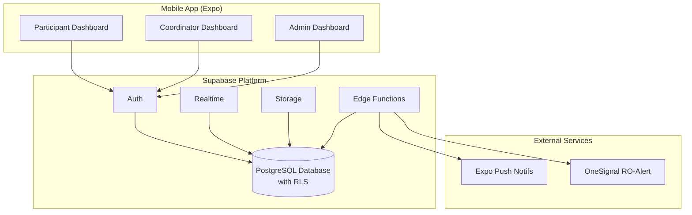
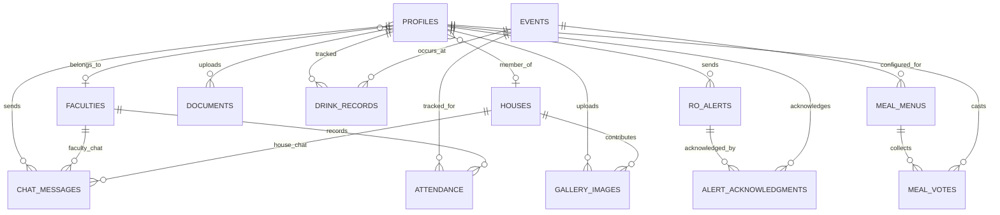

# Technical Design Document - JSU XIX App

**Version:** 1.0  
**Last Updated:** December 2024  
**Status:** Draft

---

## Table of Contents

1. [[#1. Overview|Overview]]
2. [[#2. Architecture|Architecture]]
3. [[#3. Technology Stack|Technology Stack]]
4. [[#4. Database Schema|Database Schema]]
5. [[#5. Authentication & Authorization|Authentication & Authorization]]
6. [[#6. Feature Implementations|Feature Implementations]]
7. [[#7. Mobile App Structure|Mobile App Structure]]
8. [[#8. Storage Architecture|Storage Architecture]]
9. [[#9. Security Considerations|Security Considerations]]
10. [[#10. Performance Optimizations|Performance Optimizations]]
11. [[#11. Deployment Strategy|Deployment Strategy]]
12. [[#12. Implementation Phases|Implementation Phases]]

---

## 1. Overview

### 1.1 Purpose

This document outlines the technical architecture and implementation details for the JSU XIX (Junior Summer University XIX) mobile application. The app digitalizes and streamlines the experience for participants, coordinators, and administrators during the 2-week event.

### 1.2 Scope

- Mobile application for iOS and Android
- Backend services for authentication, data storage, real-time communication
- Push notification system for critical alerts
- Document management system
- QR-based identification and drink tracking

### 1.3 Key Metrics

| Metric | Target |
|--------|--------|
| Daily Active Users | 400-450 |
| Event Duration | 2 weeks |
| App Start Time | < 3 seconds |
| QR Scan Response | < 1 second |
| Notification Delivery | Instant |

---

## 2. Architecture

### 2.1 System Architecture Diagram



### 2.2 Data Flow

1. **Authentication Flow**: User credentials → Supabase Auth → JWT token → Role-based routing
2. **Real-time Chat**: Message → Supabase Realtime → PostgreSQL → Broadcast to subscribers
3. **Document Upload**: File → Supabase Storage → Metadata in PostgreSQL
4. **Push Notifications**: Admin trigger → Edge Function → OneSignal → Device

---

## 3. Technology Stack

### 3.1 Frontend (Mobile)

| Component | Technology | Version | Purpose |
|-----------|------------|---------|---------|
| Framework | Expo | SDK 52+ | Cross-platform mobile development |
| Language | TypeScript | 5.x | Type-safe JavaScript |
| UI Library | React Native | 0.76+ | Native UI components |
| Styling | NativeWind | 4.x | Tailwind CSS for React Native |
| Navigation | Expo Router | 4.x | File-based routing |
| State Management | Zustand | 5.x | Client-side state |
| Server State | TanStack Query | 5.x | Server state & caching |
| QR Code | react-native-qrcode-svg | 6.x | QR generation |
| Camera | expo-camera | 16.x | QR scanning |

### 3.2 Backend

| Component | Technology | Purpose |
|-----------|------------|---------|
| BaaS | Supabase | Auth, Database, Storage, Realtime |
| Database | PostgreSQL 15 | Primary data store |
| Edge Functions | Deno | Server-side logic |
| Push Notifications | OneSignal | Critical RO-Alert notifications |
| Standard Notifications | Expo Push | Regular notifications |

### 3.3 Development Tools

| Tool | Purpose |
|------|---------|
| EAS Build | iOS/Android binary builds |
| EAS Submit | App store submission |
| EAS Update | Over-the-air updates |
| Supabase CLI | Local development & migrations |

---

## 4. Database Schema

### 4.1 Entity Relationship Overview



### 4.2 Enums

```sql
-- User roles in the system
CREATE TYPE user_role AS ENUM ('participant', 'coordinator', 'admin');

-- Document submission status
CREATE TYPE document_status AS ENUM ('incomplete', 'complete', 'confirmed');

-- Attendance marking types
CREATE TYPE attendance_type AS ENUM ('meal', 'accommodation');
```

### 4.3 Core Tables

#### 4.3.1 Profiles (extends Supabase auth.users)

```sql
CREATE TABLE profiles (
  id UUID PRIMARY KEY REFERENCES auth.users(id) ON DELETE CASCADE,
  username VARCHAR(100) UNIQUE NOT NULL,
  first_name VARCHAR(100) NOT NULL,
  last_name VARCHAR(100) NOT NULL,
  age INTEGER CHECK (age >= 16 AND age <= 25),
  pronouns VARCHAR(50),
  photo_url TEXT,
  role user_role NOT NULL DEFAULT 'participant',
  faculty_id UUID REFERENCES faculties(id),
  house_id UUID REFERENCES houses(id),
  room VARCHAR(20), -- Dormitory room number (cameră cămin)
  score INTEGER DEFAULT 0,
  qr_code_data VARCHAR(100) UNIQUE NOT NULL,
  document_status document_status DEFAULT 'incomplete',
  created_at TIMESTAMPTZ DEFAULT NOW(),
  updated_at TIMESTAMPTZ DEFAULT NOW(),
  
  -- Role-based assignment constraints:
  -- Participants: must have faculty AND house
  -- Coordinators: must have faculty, can have house
  -- Admins: no faculty, no house
  CONSTRAINT check_role_assignments CHECK (
    (role = 'participant' AND faculty_id IS NOT NULL AND house_id IS NOT NULL) OR
    (role = 'coordinator' AND faculty_id IS NOT NULL) OR
    (role = 'admin' AND faculty_id IS NULL AND house_id IS NULL)
  )
);

-- Indexes for common queries
CREATE INDEX idx_profiles_faculty ON profiles(faculty_id);
CREATE INDEX idx_profiles_house ON profiles(house_id);
CREATE INDEX idx_profiles_role ON profiles(role);
CREATE INDEX idx_profiles_qr ON profiles(qr_code_data);
```

#### 4.3.2 Faculties (Facultăți)

```sql
CREATE TABLE faculties (
  id UUID PRIMARY KEY DEFAULT gen_random_uuid(),
  name VARCHAR(100) NOT NULL,
  created_at TIMESTAMPTZ DEFAULT NOW()
);
```

#### 4.3.3 Houses (Căsuțe)

```sql
CREATE TABLE houses (
  id UUID PRIMARY KEY DEFAULT gen_random_uuid(),
  name VARCHAR(100) NOT NULL,
  is_revealed BOOLEAN DEFAULT FALSE, -- "Misterul căsuței" feature
  rank INTEGER, -- House ranking set by admin
  created_at TIMESTAMPTZ DEFAULT NOW()
);
```

#### 4.3.4 Events/Schedule (Program)

```sql
CREATE TABLE events (
  id UUID PRIMARY KEY DEFAULT gen_random_uuid(),
  title VARCHAR(200) NOT NULL,
  description TEXT,
  event_type VARCHAR(50) NOT NULL, -- 'meal', 'faculty', 'social', 'extracurricular', 'break'
  location VARCHAR(200),
  start_time TIMESTAMPTZ NOT NULL,
  end_time TIMESTAMPTZ NOT NULL,
  faculty_id UUID REFERENCES faculties(id), -- NULL = all faculties
  is_active BOOLEAN DEFAULT TRUE,
  created_at TIMESTAMPTZ DEFAULT NOW()
);

CREATE INDEX idx_events_start_time ON events(start_time);
CREATE INDEX idx_events_faculty ON events(faculty_id);
CREATE INDEX idx_events_type ON events(event_type);
CREATE INDEX idx_events_active ON events(is_active) WHERE is_active = true;
```

#### 4.3.5 Chat Messages

```sql
CREATE TABLE chat_messages (
  id UUID PRIMARY KEY DEFAULT gen_random_uuid(),
  sender_id UUID REFERENCES profiles(id) ON DELETE CASCADE,
  content TEXT NOT NULL,
  chat_type VARCHAR(20) NOT NULL, -- 'faculty', 'house'
  faculty_id UUID REFERENCES faculties(id),
  house_id UUID REFERENCES houses(id),
  created_at TIMESTAMPTZ DEFAULT NOW(),
  -- Ensure proper chat type mapping
  CHECK (
    (chat_type = 'faculty' AND faculty_id IS NOT NULL AND house_id IS NULL) OR
    (chat_type = 'house' AND house_id IS NOT NULL AND faculty_id IS NULL)
  )
);

CREATE INDEX idx_chat_messages_faculty ON chat_messages(faculty_id, created_at DESC) 
  WHERE chat_type = 'faculty';
CREATE INDEX idx_chat_messages_house ON chat_messages(house_id, created_at DESC) 
  WHERE chat_type = 'house';
CREATE INDEX idx_chat_messages_sender ON chat_messages(sender_id);
```

#### 4.3.6 Documents

```sql
CREATE TABLE documents (
  id UUID PRIMARY KEY DEFAULT gen_random_uuid(),
  participant_id UUID REFERENCES profiles(id) ON DELETE CASCADE,
  document_type VARCHAR(50) NOT NULL,
  -- Types: 'regulament_proiect', 'regulament_camin', 'declaratie', 'buletin', 'aviz_epidemiologic'
  file_path TEXT NOT NULL,
  uploaded_at TIMESTAMPTZ DEFAULT NOW(),
  UNIQUE(participant_id, document_type)
);

CREATE INDEX idx_documents_participant ON documents(participant_id);
```

#### 4.3.7 Drink Tracking (Evidență Băuturi)

```sql
CREATE TABLE drink_records (
  id UUID PRIMARY KEY DEFAULT gen_random_uuid(),
  participant_id UUID REFERENCES profiles(id) ON DELETE CASCADE,
  recorded_by UUID REFERENCES profiles(id),
  event_id UUID REFERENCES events(id), -- Party event
  is_blocked BOOLEAN DEFAULT FALSE, -- "Prea beat" flag
  created_at TIMESTAMPTZ DEFAULT NOW()
);

CREATE INDEX idx_drink_records_participant_event ON drink_records(participant_id, event_id);
CREATE INDEX idx_drink_records_event ON drink_records(event_id);
```

#### 4.3.8 Party Settings

```sql
CREATE TABLE party_settings (
  id UUID PRIMARY KEY DEFAULT gen_random_uuid(),
  event_id UUID REFERENCES events(id) ON DELETE CASCADE UNIQUE,
  max_drinks_under_18 INTEGER DEFAULT 0,
  max_drinks_18_plus INTEGER DEFAULT 3,
  created_at TIMESTAMPTZ DEFAULT NOW()
);
```

#### 4.3.9 Attendance (Prezență)

```sql
CREATE TABLE attendance (
  id UUID PRIMARY KEY DEFAULT gen_random_uuid(),
  faculty_id UUID REFERENCES faculties(id),
  event_id UUID REFERENCES events(id),
  attendance_type attendance_type NOT NULL,
  marked_by UUID REFERENCES profiles(id),
  marked_at TIMESTAMPTZ DEFAULT NOW(),
  UNIQUE(faculty_id, event_id, attendance_type)
);

CREATE INDEX idx_attendance_event ON attendance(event_id);
CREATE INDEX idx_attendance_faculty ON attendance(faculty_id);
```

#### 4.3.10 RO-Alert Notifications

```sql
CREATE TABLE ro_alerts (
  id UUID PRIMARY KEY DEFAULT gen_random_uuid(),
  title VARCHAR(200) NOT NULL,
  message TEXT NOT NULL,
  target_role user_role, -- NULL = all users
  sent_by UUID REFERENCES profiles(id),
  created_at TIMESTAMPTZ DEFAULT NOW()
);

CREATE INDEX idx_ro_alerts_created ON ro_alerts(created_at DESC);
```

#### 4.3.11 Alert Acknowledgments

```sql
CREATE TABLE alert_acknowledgments (
  id UUID PRIMARY KEY DEFAULT gen_random_uuid(),
  alert_id UUID REFERENCES ro_alerts(id) ON DELETE CASCADE,
  user_id UUID REFERENCES profiles(id) ON DELETE CASCADE,
  acknowledged_at TIMESTAMPTZ DEFAULT NOW(),
  UNIQUE(alert_id, user_id)
);

CREATE INDEX idx_alert_ack_user ON alert_acknowledgments(user_id);
```

#### 4.3.12 Photo Gallery

```sql
CREATE TABLE gallery_images (
  id UUID PRIMARY KEY DEFAULT gen_random_uuid(),
  image_url TEXT NOT NULL,
  uploaded_by UUID REFERENCES profiles(id),
  created_at TIMESTAMPTZ DEFAULT NOW()
);

CREATE INDEX idx_gallery_created ON gallery_images(created_at DESC);
```

#### 4.3.13 Meal Menus & Voting

```sql
CREATE TABLE meal_menus (
  id UUID PRIMARY KEY DEFAULT gen_random_uuid(),
  event_id UUID REFERENCES events(id),
  options JSONB NOT NULL, -- [{id: string, name: string, description: string}]
  voting_open BOOLEAN DEFAULT FALSE,
  created_at TIMESTAMPTZ DEFAULT NOW()
);

CREATE TABLE meal_votes (
  id UUID PRIMARY KEY DEFAULT gen_random_uuid(),
  menu_id UUID REFERENCES meal_menus(id) ON DELETE CASCADE,
  user_id UUID REFERENCES profiles(id) ON DELETE CASCADE,
  option_id VARCHAR(50) NOT NULL,
  created_at TIMESTAMPTZ DEFAULT NOW(),
  UNIQUE(menu_id, user_id)
);

CREATE INDEX idx_meal_votes_menu ON meal_votes(menu_id);
```

### 4.4 Row Level Security (RLS) Policies

#### 4.4.1 Profiles

```sql
ALTER TABLE profiles ENABLE ROW LEVEL SECURITY;

-- All authenticated users can view profiles
CREATE POLICY "Users can view all profiles" ON profiles
  FOR SELECT USING (auth.role() = 'authenticated');

-- Users can only update their own profile
CREATE POLICY "Users can update own profile" ON profiles
  FOR UPDATE USING (auth.uid() = id);

-- Only admins can insert/delete profiles
CREATE POLICY "Admins can manage profiles" ON profiles
  FOR ALL USING (
    EXISTS (SELECT 1 FROM profiles WHERE id = auth.uid() AND role = 'admin')
  );
```

#### 4.4.2 Chat Messages

```sql
ALTER TABLE chat_messages ENABLE ROW LEVEL SECURITY;

-- Faculty chat: members of faculty (participants and coordinators share faculty_id)
CREATE POLICY "Faculty chat read access" ON chat_messages
  FOR SELECT USING (
    chat_type = 'faculty' AND
    EXISTS (SELECT 1 FROM profiles WHERE id = auth.uid() AND faculty_id = chat_messages.faculty_id)
  );

CREATE POLICY "Faculty chat write access" ON chat_messages
  FOR INSERT WITH CHECK (
    chat_type = 'faculty' AND
    EXISTS (SELECT 1 FROM profiles WHERE id = auth.uid() AND faculty_id = chat_messages.faculty_id)
  );

-- House chat: only accessible when house is revealed
CREATE POLICY "House chat read access" ON chat_messages
  FOR SELECT USING (
    chat_type = 'house' AND
    EXISTS (SELECT 1 FROM houses WHERE id = chat_messages.house_id AND is_revealed = true) AND
    EXISTS (SELECT 1 FROM profiles WHERE id = auth.uid() AND house_id = chat_messages.house_id)
  );

CREATE POLICY "House chat write access" ON chat_messages
  FOR INSERT WITH CHECK (
    chat_type = 'house' AND
    EXISTS (SELECT 1 FROM houses WHERE id = chat_messages.house_id AND is_revealed = true) AND
    EXISTS (SELECT 1 FROM profiles WHERE id = auth.uid() AND house_id = chat_messages.house_id)
  );
```

#### 4.4.3 Documents

```sql
ALTER TABLE documents ENABLE ROW LEVEL SECURITY;

-- Participants can view and manage their own documents
CREATE POLICY "Participants manage own documents" ON documents
  FOR ALL USING (participant_id = auth.uid());

-- Admins can view all documents
CREATE POLICY "Admins view all documents" ON documents
  FOR SELECT USING (
    EXISTS (SELECT 1 FROM profiles WHERE id = auth.uid() AND role = 'admin')
  );
```

#### 4.4.4 Drink Records

```sql
ALTER TABLE drink_records ENABLE ROW LEVEL SECURITY;

-- Coordinators and admins can manage drink records
CREATE POLICY "Staff manage drink records" ON drink_records
  FOR ALL USING (
    EXISTS (SELECT 1 FROM profiles WHERE id = auth.uid() AND role IN ('coordinator', 'admin'))
  );

-- Participants can view their own drink records
CREATE POLICY "Participants view own drinks" ON drink_records
  FOR SELECT USING (participant_id = auth.uid());
```

#### 4.4.5 Events

```sql
ALTER TABLE events ENABLE ROW LEVEL SECURITY;

-- All authenticated users can view active events
CREATE POLICY "Users view active events" ON events
  FOR SELECT USING (auth.role() = 'authenticated' AND is_active = true);

-- Admins can manage all events
CREATE POLICY "Admins manage events" ON events
  FOR ALL USING (
    EXISTS (SELECT 1 FROM profiles WHERE id = auth.uid() AND role = 'admin')
  );
```

---

## 5. Authentication & Authorization

### 5.1 Account Generation

Accounts are pre-generated by administrators according to the following template:

- **Username**: `prenume.nume` (lowercase, e.g., `alex.popescu`)
  - Duplicates are handled by appending digits: `alex.popescu1`, `alex.popescu2`
- **Password**: 16 randomly generated characters containing:
  - Uppercase letters (A-Z)
  - Lowercase letters (a-z)
  - Numbers (0-9)
  - Special characters (!@#$%^&*)

#### Edge Function: generate-accounts

```typescript
import { createClient } from '@supabase/supabase-js';
import { nanoid } from 'nanoid';

const supabase = createClient(
  Deno.env.get('SUPABASE_URL')!,
  Deno.env.get('SUPABASE_SERVICE_ROLE_KEY')!
);

interface AccountInput {
  firstName: string;
  lastName: string;
  role: 'participant' | 'coordinator' | 'admin';
  facultyId?: string;
  age?: number;
}

export async function generateAccount(input: AccountInput) {
  const { firstName, lastName, role, facultyId, age } = input;
  
  // Generate unique username
  const baseUsername = `${firstName.toLowerCase()}.${lastName.toLowerCase()}`
    .normalize('NFD')
    .replace(/[\u0300-\u036f]/g, '') // Remove diacritics
    .replace(/[^a-z.]/g, ''); // Keep only letters and dots
  
  const username = await getUniqueUsername(baseUsername);
  const password = generateSecurePassword(16);
  
  // Create Supabase auth user with internal email
  const { data: user, error: authError } = await supabase.auth.admin.createUser({
    email: `${username}@jsu.internal`,
    password,
    email_confirm: true,
    user_metadata: { username }
  });
  
  if (authError) throw authError;
  
  // Create profile
  const { error: profileError } = await supabase.from('profiles').insert({
    id: user.user.id,
    username,
    first_name: firstName,
    last_name: lastName,
    role,
    faculty_id: facultyId,
    age,
    qr_code_data: generateQRData(user.user.id)
  });
  
  if (profileError) throw profileError;
  
  return { username, password };
}

async function getUniqueUsername(base: string): Promise<string> {
  let username = base;
  let counter = 0;
  
  while (true) {
    const { data } = await supabase
      .from('profiles')
      .select('username')
      .eq('username', username)
      .single();
    
    if (!data) return username;
    
    counter++;
    username = `${base}${counter}`;
  }
}

function generateSecurePassword(length: number): string {
  const uppercase = 'ABCDEFGHIJKLMNOPQRSTUVWXYZ';
  const lowercase = 'abcdefghijklmnopqrstuvwxyz';
  const numbers = '0123456789';
  const special = '!@#$%^&*';
  const all = uppercase + lowercase + numbers + special;
  
  // Ensure at least one character from each category
  let password = [
    uppercase[Math.floor(Math.random() * uppercase.length)],
    lowercase[Math.floor(Math.random() * lowercase.length)],
    numbers[Math.floor(Math.random() * numbers.length)],
    special[Math.floor(Math.random() * special.length)],
  ];
  
  // Fill remaining length
  for (let i = password.length; i < length; i++) {
    password.push(all[Math.floor(Math.random() * all.length)]);
  }
  
  // Shuffle
  return password.sort(() => Math.random() - 0.5).join('');
}

function generateQRData(userId: string): string {
  // Hash the user ID for security
  const encoder = new TextEncoder();
  const data = encoder.encode(userId + Deno.env.get('QR_SECRET'));
  return `jsu19:${btoa(String.fromCharCode(...new Uint8Array(data))).slice(0, 32)}`;
}
```

### 5.2 Login Flow

```typescript
// lib/supabase.ts
import { createClient } from '@supabase/supabase-js';
import AsyncStorage from '@react-native-async-storage/async-storage';
import { Database } from '@/types/database';

export const supabase = createClient<Database>(
  process.env.EXPO_PUBLIC_SUPABASE_URL!,
  process.env.EXPO_PUBLIC_SUPABASE_ANON_KEY!,
  {
    auth: {
      storage: AsyncStorage,
      autoRefreshToken: true,
      persistSession: true,
      detectSessionInUrl: false,
    },
  }
);

// hooks/useAuth.ts
import { useEffect, useState } from 'react';
import { supabase } from '@/lib/supabase';
import { useAuthStore } from '@/stores/authStore';

export function useAuth() {
  const { user, profile, setUser, setProfile, clearAuth } = useAuthStore();
  const [loading, setLoading] = useState(true);

  useEffect(() => {
    // Check initial session
    supabase.auth.getSession().then(({ data: { session } }) => {
      if (session?.user) {
        setUser(session.user);
        fetchProfile(session.user.id);
      }
      setLoading(false);
    });

    // Listen for auth changes
    const { data: { subscription } } = supabase.auth.onAuthStateChange(
      async (event, session) => {
        if (session?.user) {
          setUser(session.user);
          await fetchProfile(session.user.id);
        } else {
          clearAuth();
        }
      }
    );

    return () => subscription.unsubscribe();
  }, []);

  const fetchProfile = async (userId: string) => {
    const { data } = await supabase
      .from('profiles')
      .select('*')
      .eq('id', userId)
      .single();
    
    if (data) setProfile(data);
  };

  const login = async (username: string, password: string) => {
    const { data, error } = await supabase.auth.signInWithPassword({
      email: `${username.toLowerCase()}@jsu.internal`,
      password,
    });
    
    if (error) {
      throw new Error('Autentificare eșuată. Verifică utilizatorul și parola.');
    }
    
    return data;
  };

  const logout = async () => {
    await supabase.auth.signOut();
    clearAuth();
  };

  return { user, profile, loading, login, logout };
}
```

### 5.3 Role-Based Routing

```typescript
// app/_layout.tsx
import { useAuth } from '@/hooks/useAuth';
import { Redirect, Stack } from 'expo-router';

export default function RootLayout() {
  const { user, profile, loading } = useAuth();

  if (loading) {
    return <LoadingScreen />;
  }

  if (!user) {
    return <Redirect href="/(auth)/login" />;
  }

  // Route based on role
  switch (profile?.role) {
    case 'participant':
      return <Redirect href="/(participant)" />;
    case 'coordinator':
      return <Redirect href="/(coordinator)" />;
    case 'admin':
      return <Redirect href="/(admin)" />;
    default:
      return <Redirect href="/(auth)/login" />;
  }
}
```

---

## 6. Feature Implementations

### 6.1 QR Code System

#### 6.1.1 QR Generation (Participant Profile)

```typescript
// components/qr/ParticipantQR.tsx
import QRCode from 'react-native-qrcode-svg';
import { View, Text } from 'react-native';
import * as SecureStore from 'expo-secure-store';
import { useEffect, useState } from 'react';

interface ParticipantQRProps {
  qrData: string;
  name: string;
}

export function ParticipantQR({ qrData, name }: ParticipantQRProps) {
  const [offlineQR, setOfflineQR] = useState<string | null>(null);

  useEffect(() => {
    // Store QR data for offline access
    SecureStore.setItemAsync('qr_code_data', qrData);
    setOfflineQR(qrData);
  }, [qrData]);

  const displayQR = offlineQR || qrData;

  return (
    <View className="items-center p-6 bg-white rounded-2xl shadow-lg">
      <Text className="text-lg font-semibold mb-4 text-gray-800">{name}</Text>
      <QRCode
        value={displayQR}
        size={200}
        backgroundColor="white"
        color="#1a1a1a"
      />
      <Text className="mt-4 text-sm text-gray-500">
        Arată acest cod pentru scanare
      </Text>
    </View>
  );
}
```

#### 6.1.2 QR Scanning (Coordinator/Admin)

```typescript
// components/qr/QRScanner.tsx
import { CameraView, useCameraPermissions } from 'expo-camera';
import { useState, useCallback } from 'react';
import { View, Text, TouchableOpacity, StyleSheet } from 'react-native';
import { supabase } from '@/lib/supabase';
import { ParticipantProfile } from '@/types/database';

interface QRScannerProps {
  onScanSuccess: (profile: ParticipantProfile) => void;
  onScanError: (error: string) => void;
}

export function QRScanner({ onScanSuccess, onScanError }: QRScannerProps) {
  const [permission, requestPermission] = useCameraPermissions();
  const [scanned, setScanned] = useState(false);

  const handleBarCodeScanned = useCallback(async ({ data }: { data: string }) => {
    if (scanned) return;
    setScanned(true);

    try {
      // Validate QR format
      if (!data.startsWith('jsu19:')) {
        throw new Error('Cod QR invalid');
      }

      // Find participant by QR data
      const { data: profile, error } = await supabase
        .from('profiles')
        .select(`
          *,
          faculty:faculties(name),
          house:houses(name, is_revealed)
        `)
        .eq('qr_code_data', data)
        .single();

      if (error || !profile) {
        throw new Error('Participant negăsit');
      }

      onScanSuccess(profile);
    } catch (error) {
      onScanError(error instanceof Error ? error.message : 'Eroare la scanare');
    }

    // Reset scanner after delay
    setTimeout(() => setScanned(false), 2000);
  }, [scanned, onScanSuccess, onScanError]);

  if (!permission) {
    return <View />;
  }

  if (!permission.granted) {
    return (
      <View className="flex-1 justify-center items-center p-6">
        <Text className="text-center mb-4">
          Avem nevoie de permisiunea pentru cameră pentru a scana coduri QR
        </Text>
        <TouchableOpacity
          onPress={requestPermission}
          className="bg-blue-500 px-6 py-3 rounded-lg"
        >
          <Text className="text-white font-semibold">Acordă permisiune</Text>
        </TouchableOpacity>
      </View>
    );
  }

  return (
    <View className="flex-1">
      <CameraView
        style={StyleSheet.absoluteFillObject}
        barcodeScannerSettings={{ barcodeTypes: ['qr'] }}
        onBarcodeScanned={scanned ? undefined : handleBarCodeScanned}
      />
      <View className="absolute inset-0 items-center justify-center">
        <View className="w-64 h-64 border-2 border-white rounded-lg" />
      </View>
      {scanned && (
        <View className="absolute bottom-10 left-0 right-0 items-center">
          <Text className="text-white bg-black/50 px-4 py-2 rounded">
            Se procesează...
          </Text>
        </View>
      )}
    </View>
  );
}
```

### 6.2 Drink Tracking (Evidență Băuturi)

```typescript
// hooks/useDrinkTracking.ts
import { supabase } from '@/lib/supabase';
import { useMutation, useQuery, useQueryClient } from '@tanstack/react-query';

interface DrinkStatus {
  profile: Profile;
  currentDrinks: number;
  maxDrinks: number;
  isBlocked: boolean;
  canAddDrink: boolean;
}

export function useDrinkStatus(participantId: string, eventId: string) {
  return useQuery({
    queryKey: ['drinkStatus', participantId, eventId],
    queryFn: async (): Promise<DrinkStatus> => {
      const [profileRes, drinksRes, settingsRes, blockedRes] = await Promise.all([
        supabase
          .from('profiles')
          .select('*, faculty:faculties(name), house:houses(name)')
          .eq('id', participantId)
          .single(),
        supabase
          .from('drink_records')
          .select('id', { count: 'exact' })
          .eq('participant_id', participantId)
          .eq('event_id', eventId)
          .eq('is_blocked', false),
        supabase
          .from('party_settings')
          .select('*')
          .eq('event_id', eventId)
          .single(),
        supabase
          .from('drink_records')
          .select('id')
          .eq('participant_id', participantId)
          .eq('is_blocked', true)
          .limit(1),
      ]);

      const profile = profileRes.data!;
      const currentDrinks = drinksRes.count || 0;
      const settings = settingsRes.data;
      const isBlocked = (blockedRes.data?.length || 0) > 0;

      const maxDrinks = profile.age < 18
        ? settings?.max_drinks_under_18 || 0
        : settings?.max_drinks_18_plus || 3;

      return {
        profile,
        currentDrinks,
        maxDrinks,
        isBlocked,
        canAddDrink: !isBlocked && currentDrinks < maxDrinks,
      };
    },
  });
}

export function useAddDrink() {
  const queryClient = useQueryClient();

  return useMutation({
    mutationFn: async ({
      participantId,
      eventId,
      recordedBy,
    }: {
      participantId: string;
      eventId: string;
      recordedBy: string;
    }) => {
      const { error } = await supabase.from('drink_records').insert({
        participant_id: participantId,
        event_id: eventId,
        recorded_by: recordedBy,
        is_blocked: false,
      });

      if (error) throw error;
    },
    onSuccess: (_, variables) => {
      queryClient.invalidateQueries({
        queryKey: ['drinkStatus', variables.participantId, variables.eventId],
      });
    },
  });
}

export function useBlockParticipant() {
  const queryClient = useQueryClient();

  return useMutation({
    mutationFn: async ({
      participantId,
      recordedBy,
    }: {
      participantId: string;
      recordedBy: string;
    }) => {
      const { error } = await supabase.from('drink_records').insert({
        participant_id: participantId,
        recorded_by: recordedBy,
        is_blocked: true,
      });

      if (error) throw error;
    },
    onSuccess: (_, variables) => {
      queryClient.invalidateQueries({
        queryKey: ['drinkStatus', variables.participantId],
      });
    },
  });
}
```

#### Drink Tracking UI Component

```typescript
// components/drinks/DrinkTracker.tsx
import { View, Text, TouchableOpacity, Alert } from 'react-native';
import { useDrinkStatus, useAddDrink, useBlockParticipant } from '@/hooks/useDrinkTracking';
import { useAuth } from '@/hooks/useAuth';

interface DrinkTrackerProps {
  participantId: string;
  eventId: string;
}

export function DrinkTracker({ participantId, eventId }: DrinkTrackerProps) {
  const { profile: currentUser } = useAuth();
  const { data: status, isLoading } = useDrinkStatus(participantId, eventId);
  const addDrink = useAddDrink();
  const blockParticipant = useBlockParticipant();

  if (isLoading || !status) {
    return <LoadingSpinner />;
  }

  const handleAddDrink = () => {
    Alert.alert(
      'Adaugă băutură',
      `Adaugi o băutură pentru ${status.profile.first_name}?`,
      [
        { text: 'Anulează', style: 'cancel' },
        {
          text: 'Adaugă',
          onPress: () =>
            addDrink.mutate({
              participantId,
              eventId,
              recordedBy: currentUser!.id,
            }),
        },
      ]
    );
  };

  const handleBlock = () => {
    Alert.alert(
      'Blochează accesul',
      `Blochezi accesul la băuturi pentru ${status.profile.first_name}? (Prea beat)`,
      [
        { text: 'Anulează', style: 'cancel' },
        {
          text: 'Blochează',
          style: 'destructive',
          onPress: () =>
            blockParticipant.mutate({
              participantId,
              recordedBy: currentUser!.id,
            }),
        },
      ]
    );
  };

  return (
    <View className="p-4 bg-white rounded-xl shadow">
      {/* Participant Info */}
      <View className="mb-4">
        <Text className="text-xl font-bold">
          {status.profile.first_name} {status.profile.last_name}
        </Text>
        <Text className="text-gray-600">
          {status.profile.faculty?.name} • {status.profile.age} ani
        </Text>
        {status.profile.house?.is_revealed && (
          <Text className="text-gray-600">
            Căsuța: {status.profile.house.name}
          </Text>
        )}
      </View>

      {/* Drink Counter */}
      <View className="flex-row items-center justify-between mb-4 p-4 bg-gray-100 rounded-lg">
        <Text className="text-lg">Băuturi:</Text>
        <Text className={`text-2xl font-bold ${
          status.isBlocked ? 'text-red-500' :
          status.currentDrinks >= status.maxDrinks ? 'text-orange-500' :
          'text-green-500'
        }`}>
          {status.currentDrinks} / {status.maxDrinks}
        </Text>
      </View>

      {/* Status Messages */}
      {status.isBlocked && (
        <View className="mb-4 p-3 bg-red-100 rounded-lg">
          <Text className="text-red-700 font-semibold text-center">
            🚫 ACCES BLOCAT - Prea beat
          </Text>
        </View>
      )}

      {!status.isBlocked && status.currentDrinks >= status.maxDrinks && (
        <View className="mb-4 p-3 bg-orange-100 rounded-lg">
          <Text className="text-orange-700 font-semibold text-center">
            ⚠️ Limită atinsă
          </Text>
        </View>
      )}

      {/* Action Buttons */}
      <View className="flex-row gap-3">
        <TouchableOpacity
          onPress={handleAddDrink}
          disabled={!status.canAddDrink || addDrink.isPending}
          className={`flex-1 py-3 rounded-lg ${
            status.canAddDrink ? 'bg-green-500' : 'bg-gray-300'
          }`}
        >
          <Text className="text-white text-center font-semibold">
            Adaugă băutură
          </Text>
        </TouchableOpacity>

        <TouchableOpacity
          onPress={handleBlock}
          disabled={status.isBlocked || blockParticipant.isPending}
          className={`flex-1 py-3 rounded-lg ${
            !status.isBlocked ? 'bg-red-500' : 'bg-gray-300'
          }`}
        >
          <Text className="text-white text-center font-semibold">
            Prea beat
          </Text>
        </TouchableOpacity>
      </View>
    </View>
  );
}
```

### 6.3 Real-time Chat

```typescript
// hooks/useChat.ts
import { useEffect, useState, useCallback } from 'react';
import { supabase } from '@/lib/supabase';
import { useAuth } from '@/hooks/useAuth';
import { RealtimeChannel } from '@supabase/supabase-js';

interface Message {
  id: string;
  content: string;
  created_at: string;
  sender: {
    id: string;
    first_name: string;
    last_name: string;
    photo_url: string | null;
  };
}

export function useFacultyChat(facultyId: string) {
  const [messages, setMessages] = useState<Message[]>([]);
  const [loading, setLoading] = useState(true);
  const { profile } = useAuth();

  useEffect(() => {
    let channel: RealtimeChannel;

    const loadMessages = async () => {
      const { data } = await supabase
        .from('chat_messages')
        .select(`
          id,
          content,
          created_at,
          sender:profiles!sender_id(id, first_name, last_name, photo_url)
        `)
        .eq('chat_type', 'faculty')
        .eq('faculty_id', facultyId)
        .order('created_at', { ascending: true })
        .limit(100);

      if (data) {
        setMessages(data as unknown as Message[]);
      }
      setLoading(false);
    };

    const subscribeToMessages = () => {
      channel = supabase
        .channel(`faculty-chat-${facultyId}`)
        .on(
          'postgres_changes',
          {
            event: 'INSERT',
            schema: 'public',
            table: 'chat_messages',
            filter: `faculty_id=eq.${facultyId}`,
          },
          async (payload) => {
            // Fetch full message with sender info
            const { data } = await supabase
              .from('chat_messages')
              .select(`
                id,
                content,
                created_at,
                sender:profiles!sender_id(id, first_name, last_name, photo_url)
              `)
              .eq('id', payload.new.id)
              .single();

            if (data) {
              setMessages((prev) => [...prev, data as unknown as Message]);
            }
          }
        )
        .subscribe();
    };

    loadMessages();
    subscribeToMessages();

    return () => {
      if (channel) {
        supabase.removeChannel(channel);
      }
    };
  }, [facultyId]);

  const sendMessage = useCallback(
    async (content: string) => {
      if (!profile) return;

      const { error } = await supabase.from('chat_messages').insert({
        sender_id: profile.id,
        content,
        chat_type: 'faculty',
        faculty_id: facultyId,
      });

      if (error) {
        throw new Error('Nu s-a putut trimite mesajul');
      }
    },
    [facultyId, profile]
  );

  return { messages, loading, sendMessage };
}

export function useHouseChat(houseId: string) {
  const [messages, setMessages] = useState<Message[]>([]);
  const [loading, setLoading] = useState(true);
  const [isLocked, setIsLocked] = useState(true);
  const { profile } = useAuth();

  useEffect(() => {
    let channel: RealtimeChannel;

    const checkHouseStatus = async () => {
      const { data: house } = await supabase
        .from('houses')
        .select('is_revealed')
        .eq('id', houseId)
        .single();

      if (house && !house.is_revealed) {
        setIsLocked(true);
        setLoading(false);
        return;
      }

      setIsLocked(false);
      loadMessages();
      subscribeToMessages();
    };

    const loadMessages = async () => {
      const { data } = await supabase
        .from('chat_messages')
        .select(`
          id,
          content,
          created_at,
          sender:profiles!sender_id(id, first_name, last_name, photo_url)
        `)
        .eq('chat_type', 'house')
        .eq('house_id', houseId)
        .order('created_at', { ascending: true })
        .limit(100);

      if (data) {
        setMessages(data as unknown as Message[]);
      }
      setLoading(false);
    };

    const subscribeToMessages = () => {
      channel = supabase
        .channel(`house-chat-${houseId}`)
        .on(
          'postgres_changes',
          {
            event: 'INSERT',
            schema: 'public',
            table: 'chat_messages',
            filter: `house_id=eq.${houseId}`,
          },
          async (payload) => {
            const { data } = await supabase
              .from('chat_messages')
              .select(`
                id,
                content,
                created_at,
                sender:profiles!sender_id(id, first_name, last_name, photo_url)
              `)
              .eq('id', payload.new.id)
              .single();

            if (data) {
              setMessages((prev) => [...prev, data as unknown as Message]);
            }
          }
        )
        .subscribe();
    };

    checkHouseStatus();

    return () => {
      if (channel) {
        supabase.removeChannel(channel);
      }
    };
  }, [houseId]);

  const sendMessage = useCallback(
    async (content: string) => {
      if (!profile || isLocked) return;

      const { error } = await supabase.from('chat_messages').insert({
        sender_id: profile.id,
        content,
        chat_type: 'house',
        house_id: houseId,
      });

      if (error) {
        throw new Error('Nu s-a putut trimite mesajul');
      }
    },
    [houseId, profile, isLocked]
  );

  return { messages, loading, isLocked, sendMessage };
}
```

### 6.4 RO-Alert Critical Notifications

#### Edge Function: send-ro-alert

```typescript
// supabase/functions/send-ro-alert/index.ts
import { serve } from 'https://deno.land/std@0.177.0/http/server.ts';
import { createClient } from 'https://esm.sh/@supabase/supabase-js@2';

const ONESIGNAL_APP_ID = Deno.env.get('ONESIGNAL_APP_ID')!;
const ONESIGNAL_REST_API_KEY = Deno.env.get('ONESIGNAL_REST_API_KEY')!;

interface AlertPayload {
  title: string;
  message: string;
  targetRole?: 'participant' | 'coordinator' | 'admin' | null;
  sentBy: string;
}

serve(async (req) => {
  try {
    const { title, message, targetRole, sentBy }: AlertPayload = await req.json();

    // Create Supabase client
    const supabase = createClient(
      Deno.env.get('SUPABASE_URL')!,
      Deno.env.get('SUPABASE_SERVICE_ROLE_KEY')!
    );

    // Build OneSignal notification
    const notification: Record<string, unknown> = {
      app_id: ONESIGNAL_APP_ID,
      headings: { ro: title },
      contents: { ro: message },
      data: { type: 'ro-alert' },
      // High priority settings
      priority: 10,
      android_channel_id: 'ro-alert-critical',
      ios_sound: 'ro_alert.wav',
      android_sound: 'ro_alert',
      // Android: bypass DND
      android_visibility: 1,
      // iOS: critical alert (requires entitlement)
      ios_interruption_level: 'critical',
    };

    // Add targeting filter if role specified
    if (targetRole) {
      notification.filters = [
        { field: 'tag', key: 'role', value: targetRole },
      ];
    } else {
      notification.included_segments = ['All'];
    }

    // Send via OneSignal
    const response = await fetch('https://onesignal.com/api/v1/notifications', {
      method: 'POST',
      headers: {
        'Content-Type': 'application/json',
        Authorization: `Basic ${ONESIGNAL_REST_API_KEY}`,
      },
      body: JSON.stringify(notification),
    });

    if (!response.ok) {
      const error = await response.text();
      throw new Error(`OneSignal error: ${error}`);
    }

    // Store alert in database
    const { data: alert, error: dbError } = await supabase
      .from('ro_alerts')
      .insert({
        title,
        message,
        target_role: targetRole,
        sent_by: sentBy,
      })
      .select()
      .single();

    if (dbError) throw dbError;

    return new Response(JSON.stringify({ success: true, alertId: alert.id }), {
      headers: { 'Content-Type': 'application/json' },
    });
  } catch (error) {
    return new Response(
      JSON.stringify({ error: error.message }),
      { status: 500, headers: { 'Content-Type': 'application/json' } }
    );
  }
});
```

#### Mobile App RO-Alert Handler

```typescript
// components/alerts/ROAlertModal.tsx
import { Modal, View, Text, TouchableOpacity, Vibration } from 'react-native';
import { useEffect, useState } from 'react';
import { Audio } from 'expo-av';
import * as Haptics from 'expo-haptics';
import { supabase } from '@/lib/supabase';
import { useAuth } from '@/hooks/useAuth';

interface ROAlert {
  id: string;
  title: string;
  message: string;
}

export function ROAlertProvider({ children }: { children: React.ReactNode }) {
  const [alert, setAlert] = useState<ROAlert | null>(null);
  const [sound, setSound] = useState<Audio.Sound | null>(null);
  const { profile } = useAuth();

  useEffect(() => {
    // Subscribe to new alerts
    const channel = supabase
      .channel('ro-alerts')
      .on(
        'postgres_changes',
        {
          event: 'INSERT',
          schema: 'public',
          table: 'ro_alerts',
        },
        async (payload) => {
          const newAlert = payload.new as ROAlert & { target_role: string | null };
          
          // Check if alert targets current user
          if (
            newAlert.target_role === null ||
            newAlert.target_role === profile?.role
          ) {
            // Check if not already acknowledged
            const { data: existing } = await supabase
              .from('alert_acknowledgments')
              .select('id')
              .eq('alert_id', newAlert.id)
              .eq('user_id', profile?.id)
              .single();

            if (!existing) {
              showAlert(newAlert);
            }
          }
        }
      )
      .subscribe();

    // Check for unacknowledged alerts on mount
    checkPendingAlerts();

    return () => {
      supabase.removeChannel(channel);
      if (sound) {
        sound.unloadAsync();
      }
    };
  }, [profile]);

  const checkPendingAlerts = async () => {
    if (!profile) return;

    const { data: alerts } = await supabase
      .from('ro_alerts')
      .select('*')
      .or(`target_role.is.null,target_role.eq.${profile.role}`)
      .order('created_at', { ascending: false })
      .limit(1);

    if (alerts && alerts.length > 0) {
      const latestAlert = alerts[0];
      
      const { data: ack } = await supabase
        .from('alert_acknowledgments')
        .select('id')
        .eq('alert_id', latestAlert.id)
        .eq('user_id', profile.id)
        .single();

      if (!ack) {
        showAlert(latestAlert);
      }
    }
  };

  const showAlert = async (alertData: ROAlert) => {
    setAlert(alertData);
    
    // Play alert sound
    try {
      const { sound: alertSound } = await Audio.Sound.createAsync(
        require('@/assets/sounds/ro_alert.mp3'),
        { shouldPlay: true, isLooping: true }
      );
      setSound(alertSound);
    } catch (e) {
      console.log('Could not play sound');
    }

    // Vibrate pattern
    Vibration.vibrate([0, 500, 200, 500, 200, 500], true);
    
    // Haptic feedback
    Haptics.notificationAsync(Haptics.NotificationFeedbackType.Warning);
  };

  const handleAcknowledge = async () => {
    if (!alert || !profile) return;

    // Stop sound and vibration
    if (sound) {
      await sound.stopAsync();
      await sound.unloadAsync();
      setSound(null);
    }
    Vibration.cancel();

    // Record acknowledgment
    await supabase.from('alert_acknowledgments').insert({
      alert_id: alert.id,
      user_id: profile.id,
    });

    setAlert(null);
  };

  return (
    <>
      {children}
      <Modal
        visible={!!alert}
        animationType="fade"
        transparent={false}
        statusBarTranslucent
      >
        <View className="flex-1 bg-red-600 justify-center items-center p-8">
          <View className="w-20 h-20 mb-8">
            <Text className="text-6xl text-center">🚨</Text>
          </View>
          
          <Text className="text-white text-3xl font-bold text-center mb-6">
            {alert?.title}
          </Text>
          
          <Text className="text-white text-xl text-center mb-12 leading-8">
            {alert?.message}
          </Text>
          
          <TouchableOpacity
            onPress={handleAcknowledge}
            className="bg-white px-12 py-4 rounded-full"
            activeOpacity={0.8}
          >
            <Text className="text-red-600 text-xl font-bold">
              AM ÎNȚELES
            </Text>
          </TouchableOpacity>
        </View>
      </Modal>
    </>
  );
}
```

### 6.5 Document Upload

```typescript
// hooks/useDocuments.ts
import { useMutation, useQuery, useQueryClient } from '@tanstack/react-query';
import * as DocumentPicker from 'expo-document-picker';
import * as FileSystem from 'expo-file-system';
import { supabase } from '@/lib/supabase';
import { useAuth } from '@/hooks/useAuth';
import { decode } from 'base64-arraybuffer';

const DOCUMENT_TYPES = [
  { key: 'regulament_proiect', label: 'Regulament Proiect (semnat)' },
  { key: 'regulament_camin', label: 'Regulament Cămin (semnat)' },
  { key: 'declaratie', label: 'Declarație / Acord Parental (semnat)' },
  { key: 'buletin', label: 'Copie Buletin' },
  { key: 'aviz_epidemiologic', label: 'Aviz Epidemiologic' },
] as const;

type DocumentType = typeof DOCUMENT_TYPES[number]['key'];

interface UploadedDocument {
  document_type: DocumentType;
  file_path: string;
  uploaded_at: string;
}

export function useDocuments() {
  const { profile } = useAuth();
  const queryClient = useQueryClient();

  const documentsQuery = useQuery({
    queryKey: ['documents', profile?.id],
    queryFn: async () => {
      if (!profile) return [];
      
      const { data, error } = await supabase
        .from('documents')
        .select('*')
        .eq('participant_id', profile.id);

      if (error) throw error;
      return data as UploadedDocument[];
    },
    enabled: !!profile,
  });

  const uploadMutation = useMutation({
    mutationFn: async ({
      documentType,
      file,
    }: {
      documentType: DocumentType;
      file: DocumentPicker.DocumentPickerAsset;
    }) => {
      if (!profile) throw new Error('Nu ești autentificat');

      // Read file as base64
      const base64 = await FileSystem.readAsStringAsync(file.uri, {
        encoding: FileSystem.EncodingType.Base64,
      });

      const fileExt = file.name?.split('.').pop() || 'pdf';
      const filePath = `${profile.id}/${documentType}.${fileExt}`;

      // Upload to Supabase Storage
      const { error: uploadError } = await supabase.storage
        .from('participant-documents')
        .upload(filePath, decode(base64), {
          contentType: file.mimeType || 'application/pdf',
          upsert: true,
        });

      if (uploadError) throw uploadError;

      // Update database record
      const { error: dbError } = await supabase.from('documents').upsert(
        {
          participant_id: profile.id,
          document_type: documentType,
          file_path: filePath,
        },
        { onConflict: 'participant_id,document_type' }
      );

      if (dbError) throw dbError;
    },
    onSuccess: () => {
      queryClient.invalidateQueries({ queryKey: ['documents', profile?.id] });
    },
  });

  const submitDocuments = useMutation({
    mutationFn: async () => {
      if (!profile) throw new Error('Nu ești autentificat');

      // Check all documents are uploaded
      const uploadedTypes = documentsQuery.data?.map((d) => d.document_type) || [];
      const missingDocs = DOCUMENT_TYPES.filter(
        (dt) => !uploadedTypes.includes(dt.key)
      );

      if (missingDocs.length > 0) {
        throw new Error(
          `Documente lipsă: ${missingDocs.map((d) => d.label).join(', ')}`
        );
      }

      // Update profile status
      const { error } = await supabase
        .from('profiles')
        .update({ document_status: 'complete' })
        .eq('id', profile.id);

      if (error) throw error;
    },
    onSuccess: () => {
      queryClient.invalidateQueries({ queryKey: ['profile'] });
    },
  });

  const pickAndUpload = async (documentType: DocumentType) => {
    const result = await DocumentPicker.getDocumentAsync({
      type: ['application/pdf', 'image/png', 'image/jpeg'],
      copyToCacheDirectory: true,
    });

    if (result.canceled || !result.assets[0]) return;

    await uploadMutation.mutateAsync({
      documentType,
      file: result.assets[0],
    });
  };

  return {
    documents: documentsQuery.data || [],
    isLoading: documentsQuery.isLoading,
    documentTypes: DOCUMENT_TYPES,
    pickAndUpload,
    submitDocuments: submitDocuments.mutate,
    isUploading: uploadMutation.isPending,
    isSubmitting: submitDocuments.isPending,
  };
}
```

### 6.6 House Reveal ("Misterul Căsuței")

```typescript
// Admin action: reveal houses
// supabase/functions/reveal-houses/index.ts
import { serve } from 'https://deno.land/std@0.177.0/http/server.ts';
import { createClient } from 'https://esm.sh/@supabase/supabase-js@2';

serve(async (req) => {
  try {
    const { adminId } = await req.json();

    const supabase = createClient(
      Deno.env.get('SUPABASE_URL')!,
      Deno.env.get('SUPABASE_SERVICE_ROLE_KEY')!
    );

    // Verify admin role
    const { data: admin } = await supabase
      .from('profiles')
      .select('role')
      .eq('id', adminId)
      .single();

    if (admin?.role !== 'admin') {
      return new Response(
        JSON.stringify({ error: 'Acces interzis' }),
        { status: 403 }
      );
    }

    // Update all houses to revealed
    const { error: updateError } = await supabase
      .from('houses')
      .update({ is_revealed: true })
      .eq('is_revealed', false);

    if (updateError) throw updateError;

    // Send RO-Alert notification
    const alertResponse = await fetch(
      `${Deno.env.get('SUPABASE_URL')}/functions/v1/send-ro-alert`,
      {
        method: 'POST',
        headers: {
          'Content-Type': 'application/json',
          Authorization: `Bearer ${Deno.env.get('SUPABASE_SERVICE_ROLE_KEY')}`,
        },
        body: JSON.stringify({
          title: 'CĂSUȚELE AU FOST DEZVĂLUITE! 🏠',
          message: 'Intră în aplicație pentru a-ți descoperi căsuța și noii tăi colegi!',
          targetRole: null, // All users
          sentBy: adminId,
        }),
      }
    );

    if (!alertResponse.ok) {
      console.error('Failed to send alert:', await alertResponse.text());
    }

    return new Response(
      JSON.stringify({ success: true }),
      { headers: { 'Content-Type': 'application/json' } }
    );
  } catch (error) {
    return new Response(
      JSON.stringify({ error: error.message }),
      { status: 500 }
    );
  }
});
```

### 6.7 Coordinator Duty Shifts (Ture de Cămin)

A scheduling system for coordinator guard duties, replacing the Google Sheets-based system.

**Key Constraints:**
- Read-only for coordinators (view full timetable)
- Admin-managed (full CRUD)
- NOT visible to participants
- Push notification reminders with customizable timing

#### 6.7.1 Database Schema

```sql
-- Enum for shift types
CREATE TYPE duty_shift_type AS ENUM (
  'dorm_guard',     -- Tură de cămin
  'party_return',   -- Întoarcere de la party
  'chillzone',      -- Chillzone
  'bar',            -- Bar la party
  'party_entrance'  -- Intrare party
);

-- Main shifts table
CREATE TABLE duty_shifts (
  id UUID PRIMARY KEY DEFAULT gen_random_uuid(),
  shift_type duty_shift_type NOT NULL,
  date DATE NOT NULL,
  start_time TIME NOT NULL,
  end_time TIME,
  location VARCHAR(200),           -- For party_return, party_entrance
  bar_station VARCHAR(100),        -- For bar type (e.g., "Bar 1", "Cocktail Bar")
  event_id UUID REFERENCES events(id), -- Link to party event
  notes TEXT,
  created_by UUID REFERENCES profiles(id),
  created_at TIMESTAMPTZ DEFAULT NOW(),
  updated_at TIMESTAMPTZ DEFAULT NOW()
);

-- Coordinator assignments (many-to-many)
CREATE TABLE duty_shift_assignments (
  id UUID PRIMARY KEY DEFAULT gen_random_uuid(),
  shift_id UUID REFERENCES duty_shifts(id) ON DELETE CASCADE,
  coordinator_id UUID REFERENCES profiles(id) ON DELETE CASCADE,
  reminder_sent_at TIMESTAMPTZ,    -- Track notification delivery
  created_at TIMESTAMPTZ DEFAULT NOW(),
  UNIQUE(shift_id, coordinator_id)
);

-- Indexes
CREATE INDEX idx_duty_shifts_date ON duty_shifts(date);
CREATE INDEX idx_duty_shifts_type ON duty_shifts(shift_type);
CREATE INDEX idx_duty_shifts_event ON duty_shifts(event_id);
CREATE INDEX idx_assignments_coordinator ON duty_shift_assignments(coordinator_id);
CREATE INDEX idx_assignments_shift ON duty_shift_assignments(shift_id);

-- Add reminder preference to profiles (for coordinators)
ALTER TABLE profiles ADD COLUMN shift_reminder_minutes INTEGER DEFAULT 30;
-- Valid values: 15, 30, 60, or NULL (no reminder)
```

#### 6.7.2 RLS Policies

```sql
ALTER TABLE duty_shifts ENABLE ROW LEVEL SECURITY;
ALTER TABLE duty_shift_assignments ENABLE ROW LEVEL SECURITY;

-- duty_shifts: Coordinators can view ALL shifts, Admins have full access
CREATE POLICY "Coordinators view all shifts" ON duty_shifts
  FOR SELECT USING (
    EXISTS (SELECT 1 FROM profiles WHERE id = auth.uid() AND role IN ('coordinator', 'admin'))
  );

CREATE POLICY "Admins manage shifts" ON duty_shifts
  FOR ALL USING (
    EXISTS (SELECT 1 FROM profiles WHERE id = auth.uid() AND role = 'admin')
  );

-- duty_shift_assignments: Coordinators view all, Admins manage
CREATE POLICY "Coordinators view assignments" ON duty_shift_assignments
  FOR SELECT USING (
    EXISTS (SELECT 1 FROM profiles WHERE id = auth.uid() AND role IN ('coordinator', 'admin'))
  );

CREATE POLICY "Admins manage assignments" ON duty_shift_assignments
  FOR ALL USING (
    EXISTS (SELECT 1 FROM profiles WHERE id = auth.uid() AND role = 'admin')
  );
```

#### 6.7.3 Shift Types Reference

| Type | Romanian Label | Required Fields | Optional Fields |
|------|----------------|-----------------|-----------------|
| `dorm_guard` | Tură de Cămin | date, start_time, end_time, people | notes |
| `party_return` | Întoarcere de la Party | date, time, location, people | linked event, notes |
| `chillzone` | Chillzone | date, people | time range, notes |
| `bar` | Bar la Party | date, time, bar_station, people | linked event, location, notes |
| `party_entrance` | Intrare Party | date, time, location, people | linked event, notes |

#### 6.7.4 Edge Function: send-shift-reminders

```typescript
// supabase/functions/send-shift-reminders/index.ts
import { serve } from 'https://deno.land/std@0.177.0/http/server.ts';
import { createClient } from 'https://esm.sh/@supabase/supabase-js@2';

const ONESIGNAL_APP_ID = Deno.env.get('ONESIGNAL_APP_ID')!;
const ONESIGNAL_REST_API_KEY = Deno.env.get('ONESIGNAL_REST_API_KEY')!;

serve(async () => {
  const supabase = createClient(
    Deno.env.get('SUPABASE_URL')!,
    Deno.env.get('SUPABASE_SERVICE_ROLE_KEY')!
  );

  // Get current time in Europe/Bucharest
  const now = new Date();
  const maxWindow = new Date(now.getTime() + 60 * 60 * 1000); // 60 min ahead

  // Query shifts starting within the next 60 minutes (max reminder window)
  const { data: upcomingShifts, error } = await supabase
    .from('duty_shifts')
    .select(`
      id,
      shift_type,
      date,
      start_time,
      location,
      bar_station,
      duty_shift_assignments!inner(
        id,
        coordinator_id,
        reminder_sent_at,
        coordinator:profiles!coordinator_id(
          id,
          first_name,
          last_name,
          shift_reminder_minutes
        )
      )
    `)
    .gte('date', now.toISOString().split('T')[0])
    .lte('date', maxWindow.toISOString().split('T')[0]);

  if (error) {
    console.error('Error fetching shifts:', error);
    return new Response(JSON.stringify({ error: error.message }), { status: 500 });
  }

  const notifications: Promise<void>[] = [];

  for (const shift of upcomingShifts || []) {
    const shiftDateTime = new Date(`${shift.date}T${shift.start_time}`);
    
    for (const assignment of shift.duty_shift_assignments) {
      // Skip if already notified
      if (assignment.reminder_sent_at) continue;
      
      const coordinator = assignment.coordinator;
      const reminderMinutes = coordinator.shift_reminder_minutes;
      
      // Skip if reminders disabled
      if (reminderMinutes === null) continue;
      
      // Check if it's time to send reminder
      const reminderTime = new Date(shiftDateTime.getTime() - reminderMinutes * 60 * 1000);
      if (now < reminderTime) continue;
      
      // Send notification
      notifications.push(sendReminderAndUpdate(
        supabase,
        assignment.id,
        coordinator.id,
        shift,
        reminderMinutes
      ));
    }
  }

  await Promise.all(notifications);
  
  return new Response(JSON.stringify({ processed: notifications.length }), {
    headers: { 'Content-Type': 'application/json' },
  });
});

async function sendReminderAndUpdate(
  supabase: any,
  assignmentId: string,
  coordinatorId: string,
  shift: any,
  minutesBefore: number
) {
  const shiftLabels: Record<string, string> = {
    dorm_guard: 'Tură de Cămin',
    party_return: 'Întoarcere de la Party',
    chillzone: 'Chillzone',
    bar: 'Bar la Party',
    party_entrance: 'Intrare Party',
  };

  const title = 'Tura ta începe în curând';
  const body = `Ai ${shiftLabels[shift.shift_type]} la ${shift.start_time}${
    shift.location ? ` - ${shift.location}` : ''
  }${shift.bar_station ? ` (${shift.bar_station})` : ''}`;

  // Send via OneSignal
  await fetch('https://onesignal.com/api/v1/notifications', {
    method: 'POST',
    headers: {
      'Content-Type': 'application/json',
      Authorization: `Basic ${ONESIGNAL_REST_API_KEY}`,
    },
    body: JSON.stringify({
      app_id: ONESIGNAL_APP_ID,
      headings: { ro: title },
      contents: { ro: body },
      filters: [{ field: 'tag', key: 'user_id', value: coordinatorId }],
      data: { type: 'shift-reminder', shiftId: shift.id },
    }),
  });

  // Mark as sent
  await supabase
    .from('duty_shift_assignments')
    .update({ reminder_sent_at: new Date().toISOString() })
    .eq('id', assignmentId);
}
```

**Cron Configuration:** Run every 5 minutes via pg_cron or external cron service.

---

## 7. Mobile App Structure

```
src/
├── app/                           # Expo Router file-based routing
│   ├── (auth)/
│   │   ├── _layout.tsx
│   │   └── login.tsx
│   │
│   ├── (participant)/
│   │   ├── _layout.tsx            # Tab navigator
│   │   ├── index.tsx              # Program (Schedule)
│   │   ├── chat/
│   │   │   ├── _layout.tsx
│   │   │   ├── faculty.tsx        # Chat Facultate
│   │   │   └── house.tsx          # Chat Căsuță
│   │   ├── profile.tsx            # Profil + QR Code
│   │   ├── documents.tsx          # Încărcare Documente
│   │   ├── leaderboard.tsx        # Clasament
│   │   └── gallery.tsx            # Galerie Foto
│   │
│   ├── (coordinator)/
│   │   ├── _layout.tsx            # Tab navigator
│   │   ├── index.tsx              # Listă participanți
│   │   ├── scanner.tsx            # Scanare QR + Drink tracking
│   │   ├── chat/
│   │   │   ├── _layout.tsx
│   │   │   ├── faculty.tsx
│   │   │   └── house.tsx
│   │   ├── shifts/
│   │   │   ├── index.tsx          # Ture - Full timetable
│   │   │   └── [id].tsx           # Shift detail view
│   │   ├── settings/
│   │   │   └── reminders.tsx      # Reminder timing preference
│   │   ├── attendance.tsx         # Marcare prezență
│   │   └── schedule.tsx           # Program
│   │
│   ├── (admin)/
│   │   ├── _layout.tsx            # Drawer/Tab navigator
│   │   ├── index.tsx              # Dashboard overview
│   │   ├── events/
│   │   │   ├── index.tsx          # Listă evenimente
│   │   │   ├── [id].tsx           # Editare eveniment
│   │   │   └── create.tsx         # Creare eveniment
│   │   ├── shifts/
│   │   │   ├── index.tsx          # Listă ture coordonatori
│   │   │   ├── create.tsx         # Creare tură
│   │   │   └── [id]/
│   │   │       ├── index.tsx      # Editare tură
│   │   │       └── assign.tsx     # Asignare coordonatori
│   │   ├── houses/
│   │   │   ├── index.tsx          # Gestionare căsuțe
│   │   │   └── reveal.tsx         # Dezvăluire căsuțe
│   │   ├── alerts.tsx             # Trimitere RO-Alert
│   │   ├── gallery.tsx            # Administrare galerie
│   │   ├── documents.tsx          # Vizualizare documente
│   │   ├── reports/
│   │   │   ├── drinks.tsx         # Raport băuturi
│   │   │   ├── attendance.tsx     # Raport prezență
│   │   │   └── votes.tsx          # Raport voturi masă
│   │   └── menus.tsx              # Setare meniuri + voturi
│   │
│   ├── _layout.tsx                # Root layout with auth check
│   └── +not-found.tsx
│
├── components/
│   ├── ui/                        # Shared UI components
│   │   ├── Button.tsx
│   │   ├── Input.tsx
│   │   ├── Card.tsx
│   │   ├── Avatar.tsx
│   │   ├── Badge.tsx
│   │   └── LoadingSpinner.tsx
│   ├── chat/
│   │   ├── ChatBubble.tsx
│   │   ├── ChatInput.tsx
│   │   └── ChatList.tsx
│   ├── qr/
│   │   ├── ParticipantQR.tsx
│   │   └── QRScanner.tsx
│   ├── drinks/
│   │   └── DrinkTracker.tsx
│   ├── schedule/
│   │   ├── EventCard.tsx
│   │   └── DaySelector.tsx
│   ├── alerts/
│   │   └── ROAlertModal.tsx
│   └── documents/
│       └── DocumentUploader.tsx
│
├── lib/
│   ├── supabase.ts               # Supabase client configuration
│   ├── notifications.ts          # Push notification setup
│   └── storage.ts                # AsyncStorage utilities
│
├── hooks/
│   ├── useAuth.ts
│   ├── useChat.ts
│   ├── useProfile.ts
│   ├── useSchedule.ts
│   ├── useDrinkTracking.ts
│   ├── useDocuments.ts
│   ├── useLeaderboard.ts
│   └── useNotifications.ts
│
├── stores/
│   └── authStore.ts              # Zustand store for auth state
│
├── types/
│   ├── database.ts               # Generated Supabase types
│   └── index.ts                  # Shared types
│
├── constants/
│   ├── colors.ts                 # JSU brand colors
│   └── config.ts                 # App configuration
│
└── assets/
    ├── images/
    │   └── logo.png
    ├── sounds/
    │   └── ro_alert.mp3
    └── fonts/
```

---

## 8. Storage Architecture

### 8.1 Supabase Storage Buckets

```
Buckets:
├── profile-photos/              (Public)
│   └── {user_id}.jpg
│
├── participant-documents/       (Private)
│   └── {participant_id}/
│       ├── regulament_proiect.pdf
│       ├── regulament_camin.pdf
│       ├── declaratie.pdf
│       ├── buletin.jpg
│       └── aviz_epidemiologic.pdf
│
└── gallery/                     (Public)
    └── {timestamp}_{filename}.jpg
```

### 8.2 Storage Policies

```sql
-- Profile photos: public read, owner write
CREATE POLICY "Public profile photos" ON storage.objects
  FOR SELECT USING (bucket_id = 'profile-photos');

CREATE POLICY "Users upload own photo" ON storage.objects
  FOR INSERT WITH CHECK (
    bucket_id = 'profile-photos' AND
    auth.uid()::text = (storage.foldername(name))[1]
  );

-- Documents: owner + admin access
CREATE POLICY "Participant documents access" ON storage.objects
  FOR SELECT USING (
    bucket_id = 'participant-documents' AND (
      auth.uid()::text = (storage.foldername(name))[1] OR
      EXISTS (SELECT 1 FROM profiles WHERE id = auth.uid() AND role = 'admin')
    )
  );

CREATE POLICY "Participants upload documents" ON storage.objects
  FOR INSERT WITH CHECK (
    bucket_id = 'participant-documents' AND
    auth.uid()::text = (storage.foldername(name))[1]
  );

-- Gallery: public read, admin write
CREATE POLICY "Public gallery" ON storage.objects
  FOR SELECT USING (bucket_id = 'gallery');

CREATE POLICY "Admins manage gallery" ON storage.objects
  FOR ALL USING (
    bucket_id = 'gallery' AND
    EXISTS (SELECT 1 FROM profiles WHERE id = auth.uid() AND role = 'admin')
  );
```

---

## 9. Security Considerations

### 9.1 Authentication Security

| Aspect | Implementation |
|--------|----------------|
| Password Policy | 16 chars, mixed case, numbers, special chars |
| Session Management | Supabase JWT with auto-refresh |
| Session Storage | SecureStore (encrypted) on device |
| Login Persistence | Token stored until explicit logout |

### 9.2 Data Security

| Aspect | Implementation |
|--------|----------------|
| Row Level Security | All tables have RLS policies |
| Role Verification | Server-side role checks in Edge Functions |
| Document Storage | Private bucket with signed URLs (1-hour expiry) |
| QR Codes | Hashed user ID, not raw data |

### 9.3 GDPR Compliance

- **Data Minimization**: Only collect necessary personal data
- **Right to Access**: Users can view all their data in profile
- **Right to Deletion**: Admin can delete user data upon request
- **Data Export**: Edge function for exporting user data as JSON
- **Consent**: Document upload requires explicit action ("Gata" button)

### 9.4 API Security

```typescript
// All Edge Functions validate auth
const authHeader = req.headers.get('Authorization');
if (!authHeader) {
  return new Response('Unauthorized', { status: 401 });
}

const { data: { user }, error } = await supabase.auth.getUser(
  authHeader.replace('Bearer ', '')
);

if (error || !user) {
  return new Response('Invalid token', { status: 401 });
}
```

---

## 10. Performance Optimizations

### 10.1 QR Scanner Performance

- Target: < 1 second response time
- Implementation:
  - Use `expo-camera` native barcode detection
  - Single-frame processing (no continuous scan until acknowledged)
  - Pre-warm camera on screen mount

### 10.2 Chat Performance

- Realtime subscriptions with Supabase Channels
- Optimistic updates for sent messages
- Message pagination (100 messages per load)
- Local message cache with TanStack Query

### 10.3 Offline Support

```typescript
// Offline QR code storage
import * as SecureStore from 'expo-secure-store';

export async function cacheQRCode(qrData: string) {
  await SecureStore.setItemAsync('offline_qr', qrData);
}

export async function getOfflineQR(): Promise<string | null> {
  return SecureStore.getItemAsync('offline_qr');
}
```

### 10.4 Image Optimization

- Gallery images served via Supabase CDN
- Image transforms for thumbnails: `?width=300&height=300&resize=cover`
- Lazy loading with FlatList virtualization

### 10.5 App Startup Optimization

- Target: < 3 seconds
- Strategies:
  - Splash screen while loading auth state
  - Lazy load non-critical screens
  - Pre-fetch user profile during splash

---

## 11. Deployment Strategy

### 11.1 Environments

| Environment | Purpose | Supabase Project |
|-------------|---------|------------------|
| Development | Local testing | Local (Docker) |
| Staging | Pre-release QA | Separate cloud project |
| Production | Live application | Production project |

### 11.2 CI/CD Pipeline

```yaml
# .github/workflows/deploy.yml
name: Build and Deploy

on:
  push:
    branches: [main, staging]

jobs:
  build:
    runs-on: ubuntu-latest
    steps:
      - uses: actions/checkout@v4
      
      - name: Setup Node
        uses: actions/setup-node@v4
        with:
          node-version: '20'
          
      - name: Install dependencies
        run: npm ci
        
      - name: Run tests
        run: npm test
        
      - name: Setup EAS
        uses: expo/expo-github-action@v8
        with:
          eas-version: latest
          token: ${{ secrets.EXPO_TOKEN }}
          
      - name: Build (Staging)
        if: github.ref == 'refs/heads/staging'
        run: eas build --platform all --profile preview --non-interactive
        
      - name: Build (Production)
        if: github.ref == 'refs/heads/main'
        run: eas build --platform all --profile production --non-interactive
        
      - name: Submit to Stores
        if: github.ref == 'refs/heads/main'
        run: eas submit --platform all --non-interactive
```

### 11.3 EAS Build Configuration

```json
// eas.json
{
  "cli": {
    "version": ">= 10.0.0"
  },
  "build": {
    "development": {
      "developmentClient": true,
      "distribution": "internal"
    },
    "preview": {
      "distribution": "internal",
      "env": {
        "EXPO_PUBLIC_SUPABASE_URL": "https://staging.supabase.co",
        "EXPO_PUBLIC_SUPABASE_ANON_KEY": "staging_key"
      }
    },
    "production": {
      "env": {
        "EXPO_PUBLIC_SUPABASE_URL": "https://production.supabase.co",
        "EXPO_PUBLIC_SUPABASE_ANON_KEY": "production_key"
      }
    }
  },
  "submit": {
    "production": {
      "ios": {
        "appleId": "team@jsu.ro",
        "ascAppId": "123456789"
      },
      "android": {
        "serviceAccountKeyPath": "./google-service-account.json"
      }
    }
  }
}
```

### 11.4 OTA Updates

Non-native changes can be deployed instantly via EAS Update:

```bash
# Deploy update to production
eas update --branch production --message "Bug fix: chat loading"
```

---

## 12. Implementation Phases

### Phase 1: Foundation (Week 1)

| Task | Priority | Dependencies |
|------|----------|--------------|
| Project setup (Expo + Supabase) | P0 | None |
| Database schema migration | P0 | Project setup |
| Authentication system | P0 | Database |
| Basic UI components | P0 | Project setup |
| Profile management | P1 | Auth |
| Schedule display | P1 | Database |

**Deliverables:**
- Users can log in with credentials
- View daily schedule
- View/edit basic profile

### Phase 2: Communication (Week 2)

| Task | Priority | Dependencies |
|------|----------|--------------|
| Faculty chat | P0 | Auth, Database |
| House chat (locked state) | P0 | Faculty chat |
| QR code generation | P0 | Profile |
| QR scanner | P0 | Auth |
| House reveal system | P1 | House chat |

**Deliverables:**
- Real-time faculty chat
- House chat (hidden until reveal)
- QR codes viewable
- Coordinators can scan QR

### Phase 3: Core Features (Week 3)

| Task | Priority | Dependencies |
|------|----------|--------------|
| Document upload system | P0 | Auth, Storage |
| Drink tracking | P0 | QR scanner |
| Attendance marking | P0 | Auth |
| Party settings (admin) | P1 | Drink tracking |

**Deliverables:**
- Participants can upload documents
- Coordinators track drinks via QR
- Coordinators mark attendance

### Phase 4: Admin & Alerts (Week 4)

| Task | Priority | Dependencies |
|------|----------|--------------|
| Admin dashboard | P0 | All previous |
| RO-Alert system | P0 | Push notifications |
| Photo gallery | P1 | Storage |
| Reports (drinks, attendance) | P1 | Data collection |
| Leaderboard | P1 | Score system |
| Meal menus & voting | P2 | Events |

**Deliverables:**
- Full admin control panel
- Critical notification system
- Photo gallery
- All reports functional

### Phase 5: Polish & Launch (Week 5)

| Task | Priority | Dependencies |
|------|----------|--------------|
| End-to-end testing | P0 | All features |
| Performance optimization | P0 | Testing |
| UI/UX polish | P1 | Testing |
| App Store submission | P0 | All above |
| Documentation | P1 | Launch |

**Deliverables:**
- App published on Google Play & App Store
- User documentation
- Admin training materials

---

## Appendix A: Environment Variables

### Mobile App (.env)

```bash
EXPO_PUBLIC_SUPABASE_URL=https://your-project.supabase.co
EXPO_PUBLIC_SUPABASE_ANON_KEY=your_anon_key
EXPO_PUBLIC_ONESIGNAL_APP_ID=your_onesignal_id
```

### Supabase Edge Functions

```bash
SUPABASE_URL=https://your-project.supabase.co
SUPABASE_SERVICE_ROLE_KEY=your_service_role_key
ONESIGNAL_APP_ID=your_onesignal_app_id
ONESIGNAL_REST_API_KEY=your_onesignal_rest_key
QR_SECRET=random_secret_for_qr_hashing
```

---

## Appendix B: Romanian UI Strings

Key UI strings for the Romanian interface:

```typescript
export const ro = {
  // Auth
  login: 'Autentificare',
  username: 'Utilizator',
  password: 'Parolă',
  loginButton: 'Intră în cont',
  logout: 'Deconectare',
  loginError: 'Autentificare eșuată',
  
  // Navigation
  schedule: 'Program',
  chat: 'Chat',
  profile: 'Profil',
  documents: 'Documente',
  leaderboard: 'Clasament',
  gallery: 'Galerie',
  scanner: 'Scanner',
  attendance: 'Prezență',
  
  // Profile
  faculty: 'Facultate',
  house: 'Căsuța',
  houseHidden: '???',
  room: 'Cameră',
  score: 'Puncte',
  age: 'Vârstă',
  pronouns: 'Pronume',
  
  // Documents
  uploadDocument: 'Încarcă document',
  submitDocuments: 'Gata',
  documentTypes: {
    regulament_proiect: 'Regulament Proiect',
    regulament_camin: 'Regulament Cămin',
    declaratie: 'Declarație / Acord Parental',
    buletin: 'Copie Buletin',
    aviz_epidemiologic: 'Aviz Epidemiologic',
  },
  
  // Drinks
  addDrink: 'Adaugă băutură',
  tooDrunk: 'Prea beat',
  limitReached: 'Limită atinsă',
  accessBlocked: 'Acces blocat',
  drinks: 'Băuturi',
  
  // Alerts
  roAlertAcknowledge: 'AM ÎNȚELES',
  
  // General
  loading: 'Se încarcă...',
  error: 'Eroare',
  success: 'Succes',
  cancel: 'Anulează',
  confirm: 'Confirmă',
  save: 'Salvează',
};
```

---

## Appendix C: OneSignal Configuration

### Android Notification Channel (High Priority)

```json
{
  "id": "ro-alert-critical",
  "name": "Alerte Critice RO-Alert",
  "description": "Notificări urgente de tip RO-Alert",
  "importance": 5,
  "sound": "ro_alert",
  "vibration_pattern": [0, 500, 200, 500, 200, 500],
  "lights": true,
  "show_badge": true,
  "bypass_dnd": true
}
```

### iOS Critical Alerts

Requires Apple entitlement for critical alerts. Apply via Apple Developer portal for apps that need to bypass Do Not Disturb.

---

*Document maintained by: Development Team*  
*Last review: December 2025*

